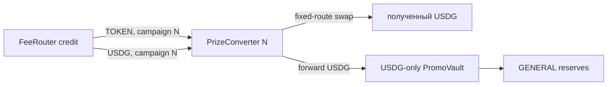

# Постоянный ответ GPT

Обновлено: 20.09.2026.

Это независимое review-мнение по состоянию репозитория, а не задание на автоматическое
исполнение. При следующем обращении файл следует переписать, а не создавать новый ответ.

Просмотрен commit `bf234c1230b72a3e23af97f714aee2c0c843b08c` —
`Build local promo automation and document review findings`.

## Короткий вердикт

Текущее направление разумное. A и C подтверждаются кодом и исполнимыми тестами; B исправлен
для заявленного сценария. Порядок `короткий fix C → TOKEN architecture/conversion → ops/RNG`
поддерживаю, пока это локальный стенд без реальных средств.

В просмотренном участке я не нашёл более тяжёлой уже воспроизводимой потери USDG. Но рядом
есть архитектурная ловушка, важная до реализации A: `FeeRouter.credit` не содержит campaign id.
Один общий converter смешает старые и новые TOKEN credits одного адреса и не сможет честно
восстановить их происхождение только по своему балансу. Это не новый exploit текущего USDG
worker, а ограничение учёта, которое способно сделать наивный следующий дизайн неверным.

Независимо повторены документированные локальные наборы после создания ignored runtime-каталога
`.local`: funding/revenue **14/14**, scheduler **6/6**, BUY-cycle **1/1**, итого **21/21**.
Полный основной набор из 201 теста в этом review не запускался.

## Findings по приоритету

### P0 — A подтверждён, открыт: TOKEN можно необратимо доставить в USDG-only vault

Место: [`FeeRouter.pay`](../contracts/FeeRouter.sol#L116-L125), общие для двух активов
`Policy.recipients` и `credit` в [`FeeRouter`](../contracts/FeeRouter.sol#L26-L40), а также
USDG-only граница `DualControllerPromoVault`.

Trigger:

1. текущая policy ставит prize vault в `recipients[0]`;
2. `_sync(projectToken)` создаёт ему TOKEN credit;
3. любой адрес вызывает `pay(projectToken, vault)`.

`pay` корректно обнуляет credit и переводит актив указанному policy recipient. Ошибка не внутри
этой функции, а в несовместимой композиции: тот же recipient используется для TOKEN и USDG,
тогда как vault умеет учитывать и резервировать только USDG. Off-chain worker, который сам не
платит TOKEN, защитой не является, потому что `pay` permissionless.

Исполнимый контрпример уже есть: тест `review: permissionless TOKEN pay reaches USDG-only vault
with no usable TOKEN reserve` в [`local-usdg-funding.test.cjs`](../test/local-usdg-funding.test.cjs).
Он получает `480 TOKEN` в vault из `600 TOKEN` revenue, обнуляет router credit и получает
`ForbiddenReserve` при попытке использовать TOKEN как резерв. Passed здесь означает
«дефект воспроизведён», а не «дефект исправлен».

Последствие: TOKEN не украден и USDG accounting не раздут, но призовая стоимость оказывается
в custody без допустимого пути конвертации или использования. Для deployment-профиля это blocker.

### P1 — C подтверждён, открыт: один recipient останавливает независимую collection

Место: выбор первого credit в [`stepFunding`](../scripts/local-usdg-funding.cjs#L33-L52),
проброс любой ошибки из [`runFunding`](../scripts/local-usdg-funding.cjs#L54-L63) и ранний
выход до source в [`runRevenue`](../scripts/local-usdg-revenue.cjs#L14-L20).

Если перевод project recipient ревертит, `runFunding` не возвращает outcome, а бросает ошибку.
Поэтому `runRevenue` не доходит до `collect` и `harvest`, хотя prize recipient уже мог быть
успешно обслужен, а новая source revenue от этой выплаты не зависит.

Контрпример — `review: blocked project recipient prevents subsequent automatic collection`:
prize credit из старых `100 USDG` выплачен, project credit `20` сохранён, но новые `600 USDG`
остаются queued и `collections() == 0`.

Это liveness/isolation defect, не потеря денег: неуспешный transfer атомарно сохраняет credit.

### P1 — соседняя архитектурная граница: credit агрегируется между campaigns

Место: `received[campaignId][asset]` campaign-scoped, но долг хранится как
`credit[asset][recipient]`; `_credit` прибавляет к этому общему ключу. `Credited` содержит
campaign id, а `Paid` — нет.

Следствие: если один и тот же converter используется в нескольких campaigns, его unpaid TOKEN
credit сливается в одну сумму. Events позволяют внешне реконструировать начисления, но один
поздний перевод и последующая продажа не дают контракту надёжно определить, какой campaign
продал сколько TOKEN. Поэтому «один converter навсегда» не удовлетворяет вопросу о поздней
conversion без дополнительного on-chain accounting.

Сейчас это не отдельная поломка принятого USDG flow: получатель имеет право на суммарный долг.
Это blocker именно для выбора следующей TOKEN-архитектуры.

### P2 — B подтверждён как узко исправленный

Проверка в [`tickKind`](../scripts/local-promo-scheduler.cjs#L45-L58)
`phase !== None || !entry.started` теперь не зависит от живости/возраста cutoff. Если scheduler
уже записал `started`, а reorg удалил on-chain begin/freeze, повторный begin запрещён даже при
сохранившемся cutoff.

Тест `previously frozen job cannot silently begin again after reorg with surviving cutoff`
сохраняет state, начинает оба вида draw, доставляет RNG, откатывает chain и проверяет отсутствие
новых транзакций. Этот конкретный баг закрыт.

Не закрыты:

- crash после broadcast/receipt, но до `selected.started = true; save(state)`;
- receipt timeout или потерянный ответ до записи tx hash в durable state;
- потеря/ручная замена state;
- production finality, выбор future randomness и reorg после раскрытия результата.

Флаг `started` не должен рекламироваться как finality. Простое полезное усиление — двухфазный
durable journal (`intent` до send, затем `txHash/nonce` сразу после получения ответа) и запрет
нового begin до явной reconciliation. Он уменьшит crash-window, но всё равно не выберет
production finality model. Для fix C это не prerequisite; до unattended production daemon — да.

## Минимальный patch C

Лучшее место изоляции — `runFunding`, но ему нужен явный план шага. `stepFunding` сейчас
одновременно выбирает действие и отправляет tx, поэтому caller не знает, какой recipient
сломался и на какой стадии возникла ошибка.

Минимальный API:

```js
planFundingStep(options, { skipRecipients }) ->
  { status: 'idle' | 'waiting' | 'stopped' }
  | { status: 'ready', action, target, method, args, recipient? }

executeFundingStep(plan, options) ->
  { status: 'progress', action, recipient?, transactionHash }

runFunding(options, { skipRecipients, maxSteps, onStep }) ->
  { status: 'idle' | 'degraded' | 'waiting' | 'yielded' | 'stopped' | 'error',
    failures: RecipientFailure[] }
```

`skipRecipients` должен принадлежать всему `runRevenue` pass и передаваться и в первый, и во
второй `runFunding`. Иначе плохой адрес будет вызван один раз до collection и второй раз сразу
после неё. Ключ разумно делать `(asset, recipient)`, а не только `recipient`.

Псевдокод:

```js
const skipped = new Set();          // один Set на весь revenue pass
const failures = [];

for (let i = 0; i < maxSteps; i++) {
  const plan = await planFundingStep(options, { skipRecipients: skipped });
  if (plan.status !== 'ready') return finish(plan.status, failures);

  try {
    await executeFundingStep(plan, options);
  } catch (error) {
    const failure = classifyTxFailure(error, plan);
    if (plan.action === 'payRecipient' && failure.definiteNoStateChange) {
      skipped.add(assetRecipientKey(plan));
      failures.push(failure);
      continue;
    }
    return stopWithoutMoreWrites(failure, failures);
  }
}
```

`degraded` возвращается только когда вся доступная работа, кроме явно skipped recipients,
исчерпана и есть хотя бы один definite recipient failure. `runRevenue` может продолжить source
после такого результата. `waiting`, `yielded`, `stopped`, unknown/ambiguous error и ошибки
не-recipient действий не разрешают следующую запись.

Это сохраняет свойства текущего дизайна:

- credit плохому recipient остаётся;
- другие recipients и source продолжают работу;
- в одном pass адрес пробуется не более одного раза;
- в следующем watch pass ephemeral set создаётся заново, поэтому восстановившийся recipient
  будет проверен снова без постоянного blacklist.

Для bounded local fix этого достаточно. Будущему supervisor нужны persisted backoff,
`nextRetryAt`, счётчик/метрика ошибок и durable tx journal; добавлять их в маленький C patch
не обязательно.

### Классификация ошибок

Одного `e.code === 'CALL_EXCEPTION'` недостаточно. Этот code может означать и revert на
`estimateGas` до отправки, и mined revert с receipt. И наоборот, неоднозначные provider errors
могут иметь другой или обёрнутый code. Классифицировать нужно по стадии и доказательствам:

| Случай | Что известно | Решение в bounded fix |
|---|---|---|
| `estimateGas`/simulation revert, нет hash/receipt | tx не отправлена, состояние не менялось | Для `payRecipient` skip и продолжить |
| Receipt есть, `status == 0` | tx mined и атомарно откачена; gas/nonce потрачены, contract state не изменён | Для `payRecipient` skip и продолжить |
| `sendTransaction` вернул ошибку, но неизвестно, принял ли RPC tx | broadcast outcome неизвестен | Остановить все новые writes, reconcile по nonce/hash |
| Receipt timeout/abort после известного hash | tx pending, mined или replaced | Остановить; не повторять intent |
| `TRANSACTION_REPLACED` | результат зависит от replacement/cancel и receipt | В маленьком fix остановить; позже проверить nonce, calldata и replacement receipt |
| Nonce conflict/underpriced replacement | возможно существует другая tx этого signer/nonce | Остановить и reconcile |
| RPC outage на чистом read до send | записи не было | Вернуть error/waiting без writes |
| RPC outage во время send/wait | outcome неоднозначен | Остановить |

Стоит хранить stage (`preflight`, `estimate`, `broadcast`, `confirm`) и при наличии — hash,
nonce и receipt. Нельзя выводить «не отправлено» только из отсутствия `transactionHash` в
произвольной ошибке провайдера.

## Рекомендуемая архитектура A

Для ближайшего skeleton я бы выбрал **узкий campaign-specific PrizeConverter как recipient
slot 0**, а не добавлял swap/withdraw в `PromoVault` и не менял весь revenue в USDG до split.



Для каждой campaign адрес converter уникален и не переиспользуется. В существующем
`FeeRouter` именно адрес тогда служит on-chain namespace старого unpaid credit. Converter
имеет immutable `campaignId`, `FeeRouter`, TOKEN, USDG, vault и ограниченный набор adapter/route.

Поведение:

- permissionless `FeeRouter.pay(TOKEN, converter)` доставляет TOKEN в допустимый inventory;
- permissionless `FeeRouter.pay(USDG, converter)` доставляет уже готовый USDG;
- permissionless `sync/forwardQuote` может отправить USDG только в зафиксированный vault;
- `convert` может продать только учтённый TOKEN, только по разрешённому route и получить
  output только на converter, после чего USDG атомарно/отдельным безопасным шагом уходит в vault;
- нет `withdraw`, arbitrary call, произвольного asset/recipient или пути в treasury проекта.

Third-party pay больше не способен загнать системный TOKEN credit в `PromoVault`, потому что
у vault нет TOKEN credit в policy; единственный его prize recipient — converter. Прямо подарить
чужой TOKEN адресу vault всё ещё технически можно, как любому адресу, но это не обнулит
системный credit и не создаст обязанность считать подарок призовым резервом.

### Campaign attribution и поздняя conversion

Уникальность converter по campaign здесь не косметика, а компенсация текущего ключа
`credit[asset][recipient]`:

- старый unpaid credit всегда платится старому converter, даже после rollover;
- новый recipient/campaign получает новый converter и отдельный баланс;
- converter events включают `campaignId`, `amountIn`, фактический `amountOut`, route id и tx;
- полезны cumulative поля `tokenRecognized`, `tokenSold`, `quoteReceived`, `quoteForwarded`;
- deployment/job проверяет, что `policy(campaign).recipients[0]` — converter с тем же
  immutable campaign id и asset bindings.

Уникальный адрес разделяет balances, но сам по себе не доказывает происхождение прямого ERC20
transfer: посторонний может подарить TOKEN converter. Для текущей модели это безопасное
добавление в невозвратный prize inventory, а creator-revenue attribution восстанавливается по
`Credited`/`Paid` и адресу converter. Если требуется строгое on-chain доказательство «получено
именно от FeeRouter, а не donation», нужен callback/deposit API в FeeRouter; обычный ERC20
transfer такого доказательства дать не может.

При этом происхождение USDG и момент его распределения — разные вещи. Поздний USDG старой
campaign попадёт в актуальную фазу GENERAL reserves в момент funding. По текущей спецификации
это допустимо: FeeRouter campaign не равна Short/Monthly cycle. Если требуется, чтобы proceeds
старой campaign финансировали конкретный старый draw/reserve epoch, нынешний vault API этого
не выражает; это отдельное продуктовое решение, а не поле event.

### Альтернативы

| Вариант | Плюсы | Минусы | Мнение |
|---|---|---|---|
| Campaign-specific converter в slot 0 | Малый change surface; сохраняет текущий split и проекту его TOKEN; vault остаётся USDG-only; старые credits разделены адресами | Новый контракт на campaign; deployment/factory дисциплина; старый inventory ограничен маршрутами своего converter | Рекомендую для skeleton |
| Переделать FeeRouter на asset-specific recipients и campaign-scoped credits | Чистый долгосрочный accounting; USDG может идти прямо в vault | Меняет core storage/API/tests; простой ERC20 transfer в общий converter всё равно не сообщает campaign без callback/отдельного адреса | Возможный production refactor, не минимальный пакет |
| Конвертировать весь TOKEN до allocation | После swap всё делится единообразно в USDG | Меняет актив project/investor долей, связывает их liveness со swap и принимает неутверждённое экономическое решение | Не рекомендую без продуктового решения |

### Минимальные swap-ограничения

Уже в skeleton нужны:

- immutable tokenIn/tokenOut и фиксированный конечный vault;
- allowlist конкретных adapter/route ids; никакого произвольного target/calldata;
- exact-input с лимитом порции не выше признанного непроданного inventory;
- `minOut`, который **не выбирает permissionless executor**. Он должен быть не ниже on-chain
  price guard (TWAP/oracle) либо заранее committed/signed order floor;
- короткий deadline и максимальный допустимый horizon;
- output recipient только converter, проверка USDG balance delta, затем forward только в vault;
- allowance только фиксированному adapter, на точную сумму и с обнулением после исполнения;
- revert целиком при плохом route, deadline или output: TOKEN остаётся inventory и может быть
  продан позже по новому допустимому order, без повторения неизвестной tx;
- события и cumulative conservation: recognized TOKEN = unsold + sold; полученный USDG =
  held + forwarded.

`minOut > 0` сам по себе не защита. Пока price source не выбран, можно построить интерфейс и
mock guard локально, но нельзя называть conversion production-safe. Для route flexibility
лучше небольшой immutable allowlist adapters, чем admin arbitrary call. Если все разрешённые
маршруты навсегда сломались, inventory честно остаётся заблокированным до заранее определённой
recovery policy; скрытый owner rescue хуже.

## Конкретные тесты ближайших пакетов

### C

1. Плохой project recipient: prize выплачен, collect/harvest происходят, project credit
   сохраняет старую и новую сумму, итог `degraded`.
2. Плохой prize recipient: project получает свою долю, collection продолжается, prize credit
   остаётся; никаких изменений frozen/claimable.
3. Один recipient вызывается максимум один раз за весь revenue pass, включая оба funding этапа.
4. После разблокировки следующий pass выплачивает ровно накопленный credit один раз.
5. Два плохих recipient не создают loop; здоровый третий обслуживается.
6. Estimation revert и mined `status=0` дают definite recipient failure; conservation сохраняется.
7. Lost send response, receipt timeout/replacement, nonce conflict и outage после broadcast
   прекращают writes: collection/следующий pay не отправляются, исходная tx не дублируется.
8. Для каждого исхода проверяются `onStep`, `failures`, tx count и итоговый status.

### A

1. Permissionless TOKEN pay увеличивает inventory нужного campaign converter, но TOKEN balance
   vault остаётся нулевым.
2. Quote pay и успешный swap дают vault ровно фактический USDG output; GENERAL accounting и
   общая conservation сходятся.
3. Slippage/deadline/wrong route/wrong output recipient полностью ревертят, TOKEN остаётся
   доступным для будущей попытки, allowance не остаётся лишним.
4. Старый credit после rollover попадает только в старый converter; новый converter и новая
   campaign не получают его и не переименовывают события.
5. Поздняя conversion старого inventory сохраняет old campaign id в accounting/events, даже
   когда FeeRouter уже в новой campaign.
6. Нельзя повторно продать уже списанный inventory, дважды forward USDG, вывести TOKEN/USDG
   проекту или выполнить arbitrary call.
7. Third-party executor не может выбрать route, recipient или ослабить price floor.

## Сейчас и позже

Сейчас: сделать C как маленькую замену outcome/control-flow без изменения payout math; затем
зафиксировать campaign-specific converter interface и его price-guard модель до написания swap.
A следует считать deployment blocker, а не просто будущим worker.

Позже: persisted retry/backoff и tx journal в общем supervisor; выбранная production finality и
future-random binding; реальный DEX/price-source canary; экономические доли creator revenue и
правило GENERAL для prize share. Эти решения не стоит тайно кодировать значениями тестового
профиля `80/20`.

Итого: порядок работ менять не нужно. Единственная существенная поправка — не делать общий
converter одним адресом для всех campaigns без изменения `FeeRouter` accounting: именно там
иначе появится незаметное смешение старого и нового дохода.
