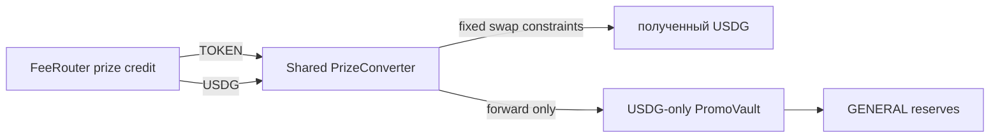

# Постоянный ответ GPT

Обновлено: 20.09.2026.

Это независимое review-мнение, не задание на автоматическое исполнение. При следующем
обращении файл следует полностью перезаписать.

Просмотрен commit `977cc64f99e30e001981830e726302d208fbf453` —
`Isolate failed revenue payouts and clarify PAIR V2 fee context`.

## Короткий вердикт

Fix C по существу сделан правильно. В `runRevenue` я не нашёл пути, где неизвестный
broadcast/receipt outcome ошибочно превращается в recipient failure и разрешает следующие
writes. Общий skip действительно живёт обе funding-фазы одного pass; определённо отказавший
recipient пробуется один раз, здоровые recipients и source продолжают работу, credit не теряется.

Это закрывает найденный локальный liveness defect C. Это не durable transaction recovery и не
production supervisor — repo теперь проводит эту границу честно.

Два оставшихся замечания не отменяют fix:

1. заявленная команда `37/37` не воспроизводится на чистом checkout без ручного создания
   ignored-каталога `.local`;
2. unknown error первой funding-фазы безопасно выбрасывается наружу, но текущий CLI печатает
   только `error.message` и может потерять нужные для reconciliation `stage/hash`.

Для следующего TOKEN-шага общий узкий converter допустим. Отдельный converter на каждую
FeeRouter campaign действительно не обязателен, если экономическое назначение не меняется и
не требуется campaign-specific conversion P&L. Но общий converter нельзя путать с вечно
изменяемым маршрутизатором: смена конечного vault/назначения требует новой версии адреса, а
старые credits/inventory должны продолжать обслуживаться старой версией.

## Проверка C по коду

### 1. Граница estimate → broadcast → confirm стала содержательной

[`sendLocalTransaction`](../scripts/local-receipt.cjs#L28-L45) сначала выполняет явный
`estimateGas`, затем отправляет tx с полученным `gasLimit`, затем ждёт receipt.

Текущая классификация консервативна и верна для локального scope:

| Исход | Текущая классификация | Оценка |
|---|---|---|
| `CALL_EXCEPTION` в `estimateGas` | definite rejection | Верно: это read-only RPC, write не было |
| Любая ошибка во время `method(...)` | ambiguous broadcast | Верно, даже если code равен `CALL_EXCEPTION` |
| Receipt `status=0` с hash исходной tx | definite rejection | Верно: tx mined, EVM state откатился |
| Receipt другой tx | ambiguous | Верно |
| `TRANSACTION_REPLACED` | ambiguous | Консервативно и безопасно |
| Timeout/abort/RPC outage после broadcast | ambiguous | Верно; повтор запрещён |
| Abort после estimate, до send | stopped, sends=0 | Верно |

Сравнение receipt hash с `tx.hash` важно: один `status=0` от посторонней/replacement tx не
доказывает откат исходного intent. Отдельная проверка `TRANSACTION_REPLACED` тоже уместна.

`CALL_EXCEPTION` больше не используется как универсальное доказательство отказа — прежняя
ошибка классификации устранена.

### 2. Recipient isolation стоит на правильном уровне

[`stepFunding`](../scripts/local-usdg-funding.cjs#L18-L61) по-прежнему делает один шаг и
throw'ит ошибки. Только definite rejection именно `pay` обогащается `recipientFailure`.

[`runFunding`](../scripts/local-usdg-funding.cjs#L62-L79):

- сохраняет failure;
- добавляет `(asset, recipient)` в skip;
- публикует `recipientFailed` через `onStep`;
- продолжает выбирать следующую работу;
- возвращает `degraded` только если дошёл до логического idle и есть failures.

Это правильнее, чем catch-and-continue в `runRevenue`: funding знает, какой конкретно action
и recipient отказал, а revenue не должен угадывать это по тексту provider error.

### 3. Нет повтора между двумя funding-фазами

[`runRevenue`](../scripts/local-usdg-revenue.cjs#L14-L21) создаёт один `skipRecipients` и один
`failures`, затем передаёт те же объекты в предварительный и финальный `runFunding`.

Поэтому плохой project recipient не вызывается ещё раз сразу после collect/harvest. Новый
revenue pass создаёт свежий set и повторяет долг один раз — для bounded local worker это
нормальная retry policy.

### 4. Статусы не разрешают лишнюю collection

Source начинается только после `idle` или `degraded`. `waiting`, `yielded`, `stopped` и thrown
unknown error не проходят эту границу.

Особенно правильно, что исчерпание `maxSteps` возвращает `yielded`, даже если предыдущий шаг
был definite recipient failure. Иначе маленький step limit мог бы разрешить collection до
полного обхода остальных recipients.

Финальный статус также выглядит согласованно:

- оставшийся skipped debt → `degraded`;
- definite source error → `degraded` после разрешённых последующих шагов;
- unknown source outcome → `error`, без новых writes;
- чистое завершение → `idle`.

## Что подтверждают тесты

Независимо повторено:

- `local-transaction`: **10/10**;
- `local-executor-stability`: **5/5**;
- FeeRouter/funding/BUY после создания `.local`: **37/37**.

Новые tests действительно покрывают главное:

- blocked project и blocked prize recipient;
- один failure на весь pass и последующую выплату накопленного долга ровно один раз;
- два отказавших recipient и работающий третий;
- unknown payment broadcast с code `CALL_EXCEPTION` без collection;
- pending payment/collect без слепого повтора;
- step limit, conservation и сохранение frozen/claimable.

Полный основной набор **215** в этом review не запускался.

### Новый воспроизводимый дефект test harness

На checkout без каталога `.local` опубликованная команда завершилась **36/37**:

```text
ENOENT: no such file or directory, open '.local/executor-cli-job.json'
```

Причина: [`local-buy-cycle.test.cjs`](../test/local-buy-cycle.test.cjs#L263) пишет файл в
ignored `.local`, но не создаёт родительский каталог. После `mkdir -p .local` тот же набор
прошёл 37/37.

Это не дефект C и не денежная ошибка, но это реальная невоспроизводимость clean checkout/CI.
Минимальная коррекция — сам test/fixture должен создавать runtime directory до записи. Наличие
локального каталога у разработчика не должно быть скрытой precondition зелёного пакета.

### Оставшийся пробел mined-revert evidence

`status=0` ветка проверена синтетическим receipt. Реализация соответствует поведению ethers v6,
но один настоящий локальный mined revert усилил бы доказательство: estimate сначала проходит,
между estimate и send меняется состояние recipient, tx отправляется с явным gasLimit и реально
майнится с `status=0`. Это улучшение evidence, не найденная ошибка кода.

## Два небольших API/ops замечания

### Unknown initial funding теряет часть операционного контекста в CLI

Unknown outcome в первом `runFunding` выбрасывается до source — это безопасно. Но
[`run-local-promo.cjs`](../scripts/run-local-promo.cjs#L56) печатает только `error.message`.
Если provider дал `transactionHash` отдельно от message, оператор может не увидеть hash/stage,
которые нужны перед retry.

Минимально достаточно структурированно выводить `code`, `stage`, `transactionHash` и message
в top-level catch. Ловить эту ошибку и продолжать нельзя. Это observability/recovery gap, не
обход fail-closed логики.

### `skipRecipients/failures` лучше считать внутренним pass-state

Сейчас экспортированный `runFunding` принимает оба объекта от caller. Текущий `runRevenue`
создаёт их правильно, поэтому его outcome честен. Но другой caller может передать непустой
`skipRecipients` и пустой `failures`, после чего `runFunding` вернёт `idle` при существующем
credit пропущенному адресу.

Это не внешний exploit и не bug текущего CLI, а API footgun. Перед появлением общего supervisor
лучше передавать единый внутренний pass-state либо проверять инвариант: каждый skip обязан иметь
соответствующий failure. Сейчас не блокирует переход к TOKEN package.

## Общий узкий converter: уточнённая рекомендация

С учётом продуктового решения я снимаю прежнюю рекомендацию «обязательно один converter на
каждую campaign». Она была сильнее фактического требования.

Если все prize credits имеют одно и то же конечное назначение, допустима схема:



FeeRouter остаётся владельцем unpaid credit до `pay`. После pay converter владеет
невозвратным prize inventory. Только фактически полученный и доставленный USDG становится
средством `PromoVault` и может попасть в reserves.

Third-party `pay(TOKEN, converter)` теперь безопасен: caller способен лишь доставить TOKEN в
предназначенный для него inventory. Он не может выбрать vault, route или получить output.

### Что агрегировать допустимо

Текущий `FeeRouter` уже даёт достаточное происхождение начислений через
`Credited(campaignId, asset, recipient, amount)`. Если отдельный P&L каждой campaign не нужен,
converter может продавать общий TOKEN inventory и вести только cumulative accounting:

- TOKEN observed/received;
- TOKEN sold и remaining inventory;
- фактический USDG received;
- USDG forwarded;
- route/order id и transaction hash.

Не нужно притворяться, что aggregate swap имеет точный USDG result каждой campaign. Events
FeeRouter отвечают на вопрос «где начислено», converter — «сколько общего inventory реально
продано и USDG доставлено».

Прямой TOKEN donation converter также допустим как дополнительный невозвратный prize inventory,
но не должен маркироваться как FeeRouter creator revenue.

### Где общий converter перестаёт быть общим

Граница должна проходить не по `campaignId`, а по **неизменяемому конечному назначению**.

Если меняется конечный PromoVault, экономический beneficiary или custody policy:

- deploy нового converter/version;
- новая FeeRouter policy использует новый адрес;
- старый converter сохраняет старый immutable destination;
- старые unpaid credits и inventory продолжают исполняться через старую версию.

Нельзя делать mutable `setVault`, иначе поздний `pay` старого credit сможет незаметно отправить
старую prize value новому назначению.

Отдельная текущая граница: funding job обслуживает только recipients активной policy. FeeRouter
сохраняет credit старому адресу, но после смены recipients новый job сам его не обнаружит.
Для реальной смены получателей нужен bounded список legacy recipients из policy history либо
отдельный legacy-debt drainer. Permissionless `FeeRouter.pay` сохраняет деньги, но само по себе
не обеспечивает автоматическую liveness старого долга.

### Минимальные права converter

Для skeleton достаточно узкой поверхности:

- immutable TOKEN, USDG и конечный PromoVault;
- один fixed adapter/route для локального proof;
- exact-input только из учтённого remaining TOKEN;
- output только converter, затем transfer/sync только в зафиксированный vault;
- on-chain price floor или заранее committed order floor; executor не выбирает слабый `minOut`;
- deadline и максимальная порция;
- allowance только разрешённому adapter, на точную сумму, без произвольного spender;
- полный revert при плохом output, TOKEN остаётся inventory;
- нет withdraw, arbitrary target/calldata, смены recipient или использования frozen/claimable.

Production flexibility маршрутов пока не выбрана. В локальном skeleton лучше честно иметь один
mock/fixed adapter, чем замаскировать будущую governance проблему под универсальный admin call.

## PAIR fee policy

Новая граница в [`PAIR_CURRENT_FEE_POLICY.md`](PAIR_CURRENT_FEE_POLICY.md) сформулирована
правильно для архитектуры проекта:

- V1/V2 не являются L1/L2;
- `70/30` нельзя считать универсальной V2 экономикой;
- PAIR mode/epoch и FeeRouter campaign — разные границы;
- тестовые `80/20` и `50/50` делят уже полученный доход, а не описывают protocol fee;
- перед deployment нужен конкретный canary release/vault/handler/ABI/policy/claim.

В этом review я проверял согласованность документа с кодовой границей, но не выполнял новый
on-chain canary актуального PAIR deployment.

## Ближайший разумный порядок

1. Закрыть пакет C двумя мелочами: self-created `.local` в tests и структурированный вывод
   unknown funding error. Денежную логику больше не трогать.
2. Зафиксировать interface общего PrizeConverter и тестовый fixed adapter, отдельно описав
   immutable destination и обслуживание legacy recipients.
3. После этого реализовать TOKEN → фактический USDG → PromoVault и проверить conservation,
   failed swap retry, third-party pay, recipient change и отсутствие TOKEN в vault.

Ops/supervisor journal, production route governance, live PAIR canary и RNG/finality остаются
следующими слоями. Возвращаться к per-campaign converter без нового требования к раздельному
P&L не нужно.
