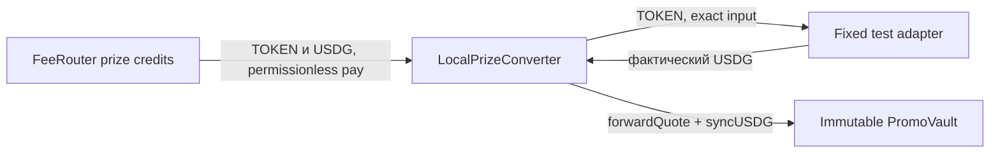

# Локальный призовой конвертер

24.09: пользователь выбрал заменяемый adapter с задержкой. Это реализовано отдельным
[LocalScheduledPrizeConverter](SCHEDULED_PRIZE_CONVERTER.md); описанный ниже старый
контракт не менялся. Рыночный источник цены и новый worker profile пока не подключены.

20.09.2026. Ограниченный контрактный proof для chainId 31337, не production swap.
Код: [LocalPrizeConverter](../contracts/LocalPrizeConverter.sol),
[IPrizeSwapAdapter](../contracts/IPrizeSwapAdapter.sol),
[тестовый адаптер](../test/contracts/PrizeSwapFixture.sol).

## Решение и назначение

Все денежные призы — USDG. Общий converter может быть recipient slot 0 FeeRouter,
если его конечное назначение неизменно. Отдельный converter на каждую FeeRouter campaign
не требуется: начисления уже размечены событиями FeeRouter, а долларовый P&L продажи
каждой campaign не обещается. Смена vault/назначения требует нового адреса converter;
старые credits и inventory остаются за старой версией.

У converter нет owner, setVault, setAdapter, withdraw или произвольных target/calldata.
Constructor проверяет asset bindings destination/adapter и разрешает только chainId 31337.
TOKEN/quote, vault, adapter, floor numerator/denominator, maxInput и maxHorizon immutable.

## API и accounting

- `sync()` распознаёт балансы TOKEN/USDG. Кто вызвал sync, не объявляется источником денег.
- `remainingToken = tokenObserved - tokenSold`; `heldQuote = quoteObserved - quoteForwarded`.
- `convert(amount, deadline)` делает sync и продаёт amount <= remainingToken и maxInput.
  Deadline не в прошлом и не дальше maxHorizon. Минимум выхода вычисляет сам converter:
  ceil(amount × floorNumerator / floorDenominator), в raw units активов. Executor не
  задаёт minOut, route, spender или получателя.
- `forwardQuote()` делает sync, переводит весь heldQuote только в immutable vault,
  проверяет balance delta и вызывает syncUSDG. Перевод/признание — одна атомарная tx.
  Нулевой повтор ничего не платит.

Swap allowance ровно amount только fixed adapter; после успешного swap allowance ноль.
Converter проверяет, что TOKEN списан ровно amount, USDG вырос минимум на рассчитанный
floor. Return value адаптера не является доказательством выплаты. Bad output, частичный
input, другой output recipient, revert или reentrancy откатывают весь convert.

Успешный swap оставляет USDG в converter; отдельный forward может выполняться независимо
от доступности swap. Отказ forward сохраняет USDG и счётчики. Swap не трогает frozen/claimable
vault. Позднее пополнение идёт в текущую GENERAL фазу свободных резервов, не в старый draw.

После sync и успешных операций:

- tokenObserved = tokenSold + TOKEN balance;
- quoteObserved = quoteForwarded + USDG balance;
- наблюдение новых средств не уменьшает старые долги;
- проданный inventory и forwarded USDG нельзя использовать повторно.

До sync прямые donations находятся сверх наблюдённых сумм. Events InventoryObserved,
Converted и QuoteForwarded не приписывают donation creator revenue и не выдумывают
campaign P&L. Transfer-fee/rebasing активы не поддерживаются; контракт проверяется
для стандартных TOKEN/USDG. Случайные другие ERC20 не имеют rescue-пути.

## Граница готовности и следующий шаг

Это НОВЫЙ локальный deployment-профиль. Старые funding jobs всё ещё требуют vault
непосредственно в recipient slot 0; converter теперь обслуживает отдельный
[local-prize-flow-v1](LOCAL_PRIZE_FLOW.md).
Поэтому новый профиль использует безопасный TOKEN recipient, но старый несовместимый профиль
не стал безопасным автоматически. Production deployment по-прежнему отсутствует.

Fixed raw-unit floor — тестовое допущение, не цена рынка и не защита от реального MEV.
Fixture имеет искусственный обменный курс и заранее внесённую USDG-ликвидность;
его failure controls доступны тестам. Реальный DEX/price guard и гибкость маршрутов
нуждаются в отдельном решении. Заблокированный навсегда adapter может оставить TOKEN
inventory неподвижным; скрытого owner rescue нет. USDG по-прежнему можно forward.

Реализовано ограниченное автоматическое обслуживание явно перечисленных старых
recipients/converters в local-prize-flow-v1. Полнота legacy списка остаётся ответственностью
конфигурации; автоматического поиска всей истории нет.
Не менять fixed destination старого converter для обхода этой задачи.

## Проверки 20.09.2026

- `node --test test/local-prize-converter.test.cjs`: **5/5**, ~32 s.
  Проверены third-party pay, общая казна, неизменность frozen reserve, баланс/allowance,
  положительный output ниже floor, отказ/reentrancy/partial input/wrong recipient,
  retry swap/forward, donation, late credits и смена immutable destination.
- `node --test test/local-transaction.test.cjs`: **11/11**, включая structured CLI error.
- Runtime LocalPrizeConverter: **4 556 bytes**, optimizer runs=200, solc из package lock.

Первый общий запуск выявил неверный адрес controller в новом тестовом PromoVault;
исправлен fixture, затем весь набор converter повторён успешно. Код FeeRouter и PromoVault
не менялся. Основной набор теперь **221** тест, полного запуска 221 не было.
Лог финального converter набора: `.local/logs/local-converter-final.log` (ignored).

BUY-cycle: **1/1**, ~101 s, из изолированного cwd с junctions на исходники и dependencies,
копиями package/config и отсутствующим `.local` перед запуском. Тест сам создал runtime
каталог. Это проверка устранения скрытой filesystem precondition, не отдельная установка
npm dependencies с нуля. Лог `.local/logs/converter-clean-buy.log` (ignored).
Итого 17 уникальных проверок в трёх наборах; полный набор 221 не запускался.
