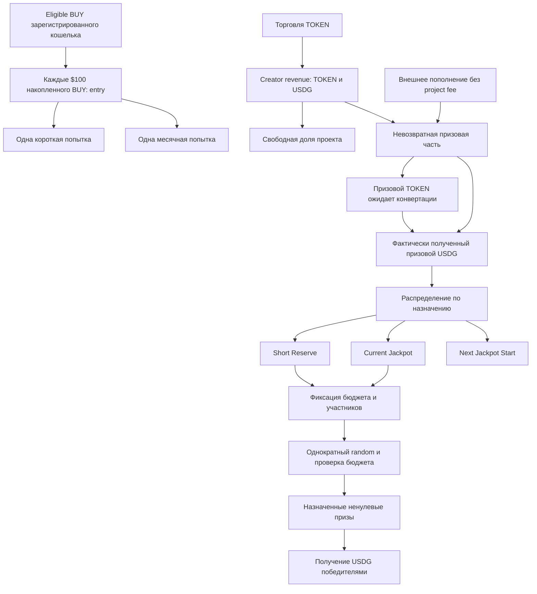

# Promo — актуальные продуктовые правила

Обновлено: 13.09.2026, после реализации согласованного USDG funding в PromoVault. Продуктовые параметры draws и creator shares этим не утверждены.

**Главный источник текущих решений.** «Принято» означает согласованную продуктовую логику, а не наличие реализации. «Кандидат» нельзя включать в код как утверждённую настройку. Состояние кода — в [IMPLEMENTATION_STATUS.md](IMPLEMENTATION_STATUS.md). Исторические документы не переопределяют этот файл.

## 1. Назначение и границы

**Принято.** Обычный спекулятивный meme TOKEN и отдельное добровольное Promo. Торговля создаёт creator revenue, допустимые покупки зарегистрированных кошельков создают билеты. Поощрения — короткие розыгрыши и месячный jackpot; будущие физические/спонсорские призы сейчас не проектируются.

Все денежные призы выплачиваются в **USDG**. TOKEN — торговый актив и источник части комиссий, но не призовой номинал.

Система может жить без спонсоров на комиссиях. Нет торговли — нет нового комиссионного дохода; накопленные средства сохраняются. Доходность, окупаемость BUY и обязательная выплата по расписанию не обещаются.

Ограничиваем доминирование **одного зарегистрированного кошелька в одном draw**. Не обещаем cap на человека, за всё время или отрицательное EV любого farming. Несколько кошельков одного человека — принятый остаточный риск MVP; identity/KYC для доказательства уникальности не добавляем. Это не разрешение администратору менять случайный результат.

## 2. Общая схема



Прямой путь Prize → USDG относится только к уже поступившему USDG. Призовой TOKEN до обмена не является USDG-резервом.

## 3. Деньги проекта и деньги призов

**Принято:** свободная доля проекта отделяется от creator revenue **до** поступления в призовую часть. Проект может расходовать её на развитие либо добровольно пополнить ею призы. Размер доли пока не утверждён.

После попадания на призовую сторону средства нельзя вывести владельцу/спонсору, вернуть по требованию или переименовать в свободные средства проекта. Их назначение — призы; до выдачи они могут храниться, конвертироваться по правилам и резервироваться. Добровольное пополнение от самого проекта также невозвратно.

RNG, исполнитель транзакций, RPC, сервер и разработка оплачиваются **вне** призового фонда. Контракт не запускается самостоятельно по таймеру: автоматизация потребует исполнителя и отдельного бюджета.

Запрет admin withdrawal не заменяет проверку условий swap и назначения winners: через неправильные обмены или произвольные результаты также можно передать стоимость посторонним. Это требования к будущей реализации, а не уже доказанные свойства всей системы.

## 4. Три призовых резерва и признание поступлений

| Назначение | Смысл |
|---|---|
| Short Reserve | Постоянный запас USDG для коротких розыгрышей |
| Current Jackpot | Накопление главного месячного приза, без верхнего лимита |
| Next Jackpot Start | Обеспеченная основа следующего jackpot cycle, с заданной целью T |

Свободный резерв, зафиксированный бюджет draw и назначенный долг победителю — **разные состояния одних средств**, а не дополнительные деньги. Один USDG не может одновременно финансировать два назначения. Неполученный приз не становится свободным снова.

Поступления не меняют уже зафиксированные призы. Новые средства с назначением Current Jackpot во время ожидания monthly result учитываются отдельно для последующих розыгрышей. Конкретная проводка этого остатка при win/no-win ещё должна быть определена при проектировании перехода.

## 5. Внешнее пополнение — утверждённое распределение

**Принято явно:** внешнее призовое funding без project fee. Автоматическое распределение, без ручного выбора долей администратором для каждого поступления.

### Общее пополнение

Пока Next Start не заполнен, пропорция **3:2:1**:

| Назначение | Доля общего funding |
|---|---:|
| Short | 1/2 = 50% |
| Current | 1/3 = 33⅓% |
| Next | 1/6 = 16⅔%, не выше недостающей суммы |
| Проект | 0% |

Излишек доли Next всегда идёт в Current. После заполнения Next получается **50% Short / 50% Current**.

Для суммы X и свободного Next N при цели T идеальная арифметика:

```text
short = X / 2
next  = min(X / 6, max(T - N, 0))
current = X - short - next
```

Предел Next учитывается внутри пополнения, даже если оно пересекает цель. В реализации raw units распределяются непрерывным циклом SHORT/CURRENT/SHORT/CURRENT/SHORT/NEXT, с сохранением фазы между общими пополнениями. Это точные 3:2:1 на полных группах, а не приближённые 33,33%/16,67%. Микроостатки учитываются сразу, нет отдельной пыли. Дробление при том же порядке операций сохраняет итог; подробности в PROMO_VAULT_DESIGN. Формулы выше — идеальная дробная модель, не floor заново на каждом вызове.

### Целевое пополнение

| Выбранное назначение | Результат |
|---|---|
| Short | Вся сумма в свободный Short |
| Current | Вся сумма в свободный Current, верхнего лимита нет |
| Next | Заполняет только недостающее до T; **весь излишек в Current** |

Пример: Next недостаёт 20 USDG.

- Общее funding 600 → Short 300, Next 20, Current 280.
- Целевое Next funding 600 → Next 20, Current 580.
- Next уже заполнен: общее 600 → Short 300, Current 300; целевое Next 600 → Current 600.

Прямой ERC20 transfer не содержит выбранного назначения. Принято и реализовано: такие USDG transfers распознаются permissionless syncUSDG как GENERAL по опубликованному правилу. Целевое назначение задаётся только fundUSDG; прежние direct transfers синхронизируются до нового целевого transferFrom. Вызывающий sync не объявляется отправителем денег. Поддержка внешнего TOKEN funding с сохранением назначения через последующую конвертацию также ещё не специфицирована. Первый этап — USDG.

### Не путать с creator revenue

Пропорции выше утверждены для **внешних** пополнений. Они не утверждают автоматически предложенные 10% проекта или разделение всех creator fees 10/45/30/15. Доли creator revenue и использование той же 3:2:1 для его призовой части остаются кандидатами.

## 6. Конвертация TOKEN

**Принят порядок:** обмен → фактически полученный USDG → распределение → резервирование обеспеченного draw → random → начисление.

- Призовой TOKEN до обмена — отдельный инвентарь, не обещание USDG по котировке.
- Отдельно фиксируются реальные проданные TOKEN, полученный USDG, средняя фактическая цена и транзакция.
- Неудачный обмен оставляет TOKEN призовыми; ранее накопленный USDG может обслуживать розыгрыш.
- Обмен не обязательно совпадает с шестичасовой проверкой.
- Регулярная продажа TOKEN ради USDG-призов — принятый экономический компромисс.
- Порции, частота, маршрут, минимальный выход и источник допустимой цены ещё не выбраны. Получатель выхода не может произвольно меняться в пользу проекта.

## 7. Билеты и их срок жизни

**Принято:** $100 накопленного eligible BUY = entry, остаток переносится; SELL не отменяет entry, holding не требуется. Каждая entry даёт одну короткую и одну месячную попытку.

Если draw не стартовал, попытки сохраняются. Если случайный выбор состоялся, все участвовавшие попытки соответствующего типа расходуются, включая проигравших, кандидатов без доступного бюджета и случай полного отсутствия победителей. Короткая попытка не расходует месячную.

Рабочая eligibility-основа — зарегистрированный кошелёк, прямой канонический TOKEN/USDG BUY, установленный плательщик и конечный получатель. Точное attribution, оценка $100 в USDG, границы cutoff и rounding ещё требуют спецификации; не заменяем gross BUY на net BUY незаметно.

Предпочтительная организационная схема, пока не полное утверждённое ТЗ:

```text
OPEN: попытки доступны
FROZEN: набор закрыт, попытки заблокированы за draw
FINALIZED: попытки использованы, результат окончательный
```

При freeze открывается следующий набор для новых BUY. Кандидат месячного carry — один OPEN набор с добавлением новых попыток, пока monthly не стартовал, без очереди отдельных месяцев. Безопасное завершение ошибки после freeze ещё не определено; нельзя автоматически возвращать попытки, если это даёт повторный выбор уже известного результата.

## 8. Short: повезло / не повезло

**Принята упрощённая модель:** промежуточный допуск не означает победу. Победитель — только кошелёк, которому назначен конкретный ненулевой обеспеченный USDG-приз.

1. Раз в 6 часов проверяем готовность бюджета и билетов. Нет условий → пропуск без расходования попыток.
2. Фиксируем участников, правила и максимальный разрешённый расход D из свободного Short.
3. По random определяем кандидатов с ограниченным шансом кошелька.
4. Кандидатов обрабатываем в случайном, зафиксированном результатом порядке. Ни администратор, ни скорость claim его не выбирают.
5. Определяем возможный приз кандидата. Если он ненулевой, проходит установленный минимум и полностью помещается в оставшийся бюджет — назначаем и уменьшаем остаток.
6. Не хватает денег или сумма слишком мала → выигрыша нет. Не обещаем награду каждому допущенному.
7. Остаток остаётся в Short; участвовавшие короткие попытки расходуются.

Не выводим «вы победили» до назначения денег. Нет «вы выиграли 0 USDG». Уже назначенная сумма не уменьшается, обеспечена целиком и доступна для claim. Нехватка проверяется при определении результата, **не при получении приза**.

Округления и неподходящие мелкие суммы остаются в призовой части. «В пользу казино» означает заранее объявленное правило отсутствия выигрыша, а не присвоение остатка проектом или возможность вручную менять outcome.

Таблица размеров призов, минимальная сумма и точная обработка следующего кандидата после отказа ещё нуждаются в окончательных параметрах. Кандидат — отказ без повторной генерации/уменьшения приза, затем переход к следующему кандидату.

**Больше не требуется** гарантировать минимальный приз всем возможным допущенным кошелькам. Старые SpendFactor + нормализованные веса не являются текущей обязательной схемой.

## 9. Шансы

**Принято:** cap на вероятность получения хотя бы одного приза кошельком в одном draw, отсутствие гарантированного победителя, отсутствие reroll ради удобного результата.

Кандидат вероятности допуска: `q(e) = p_max × e / (e + h)`, с отдельными параметрами short/monthly. Дополнительная проверка бюджета может только снизить итоговую вероятность short. Не показываем q как точную вероятность получения USDG.

Формула, значения p_max/h и способ получения случайности пока не утверждены. Вероятность выигрыша за множество draws не ограничена потолком одной попытки. Человек с несколькими кошельками не обязан укладываться в cap одного адреса.

## 10. Monthly и следующий старт

**Принято:** раз в месяц проверяем готовность; текущий jackpot разыгрывается только после обеспечения следующего старта до цели T. Обязательной ежемесячной выплаты нет. Current может расти без верхнего лимита. Next не поглощает излишки сверх цели: они идут в Current.

Кандидат random: допуск кошельков с q_month(e), затем один равномерно выбранный победитель среди допущенных, без повторного веса за entries. Нет допущенных → нет победителя.

- Win: зафиксированный текущий приз становится долгом победителю; следующий старт становится основой нового Current; начинается накопление нового Next.
- No win: текущие призовые деньги и следующий старт сохраняются.
- При состоявшемся random участвовавшие месячные попытки использованы в обоих случаях.
- Claim не определяет начало следующего цикла. Неполученный выигрыш остаётся долгом, не пополняет следующий draw.

Размер T и правило его выбора ещё не утверждены. Предпочтение — фиксированная цель внутри цикла, без движения вслед за растущим Current. Как определить первый старт и когда меняются цели будущих циклов — открытые настройки.

Продуктовая цель: jackpot главный приз. Ограничение короткого D относительно Current J **в момент freeze** — кандидат. Оно не означает ретроактивного пересчёта D после выигрыша jackpot. Последовательность short/monthly и обращение с новыми Current-поступлениями во время pending нужно завершить в state machine. FeeRouter campaign, jackpot cycle и набор monthly attempts — разные понятия.

## 11. Предложения чисел — НЕ утверждённые настройки

Этот список сохранён, чтобы прежние примеры не превратились в требования по ошибке.

| Параметр | Последнее предложение, требует принятия |
|---|---|
| Creator revenue | 10% project / 45% short / 30% current / 15% next; после заполнения next — 10/45/45/0 |
| Next target | Фиксированная сумма на цикл; 100 USDG был только примером |
| Short exposure | min(10% свободного Short, 10% Current) |
| Размеры short | 5% / 15% / 50% начального D с вероятностями 70% / 25% / 5% |
| Минимальный prize | 1 USDG; D ≥ 20 USDG для приведённой таблицы — только предложение |
| Short q | p_max=40%, h=3 |
| Monthly q | p_max=20%, h=3 |
| Минимум участников | Предложено убрать старые 30 entries и требовать хотя бы один wallet; не утверждено |

**Уже утверждённые** 3:2:1 для внешнего funding, 50:50 после наполнения Next и перевод излишков в Current находятся в разделе 5, а не в этой таблице.

## 12. Следующий этап и оставшиеся решения

Первый этап реализован в локальном PromoVault: USDG общее/целевое пополнение, предел Next и overflow в Current, отсутствие project fee с внешних денег и изоляция свободных средств от reserved/claimable. Существующие reserve/finalize адаптированы бухгалтерски; логика random не добавлялась.

API, direct transfers, rounding и связь с reserve/finalize описаны в [PROMO_VAULT_DESIGN](PROMO_VAULT_DESIGN.md). В этой промежуточной версии T положителен и immutable при развёртывании; Next нельзя потратить и пока нельзя перевести в Current. Переход jackpot cycle, новый target и принадлежность pending/current additions требуют отдельного следующего этапа. Три recipients FeeRouter не являются тремя новыми призовыми резервами.

Следующие продуктовые решения: creator shares, T, short prizes/readiness, параметры q, monthly carry и смена правил. Технические отдельные задачи: conversion, indexer, RNG/state machine, обработка задержек, проверка масштабов draw. Frontend и физические призы — позже. Публичного запуска нет.

## 13. Направление trust/mutability — обсуждение 13.09

Поддержано направление: неизменяемы ограничения полномочий и уже возникшие обязательства, а параметры фиксированных алгоритмов могут версионироваться для будущих периодов. Это не разрешение на произвольную замену кода controller или внедрение proxy. Точная архитектура/полномочия активации пока обсуждаются, код этим разделом не менялся.

- Просто запретить withdraw недостаточно: произвольный новый controller/module способен направить старый free balance владельцу под видом приза. Версия только для новых draws сама по себе этот обход не закрывает.
- Предпочтительный кандидат — стабильные custody и проверка draw плюс ограниченные версии параметров. Проверка участников и random остаётся отдельной необходимой границей доверия.
- Для конечного продукта T фиксируется на цикл; цель следующего объявляется заранее, не после знания исхода. Текущий lifetime immutable T остаётся ограничением funding-прототипа, не обещанием вечного размера старта.
- Новые настройки не переписывают открытое/замороженное участие. При смене порога entry нужно учесть также накопленный BUY carry, не только готовые билеты.
- Простой кандидат monthly: старый OPEN остаётся на старых правилах, обновление ждёт нового набора. Задержка обновления — явный компромисс.
- Версии параметров не исправляют произвольный баг неизменяемого исполняемого кода. Универсального безопасного recovery пока не выбрано.
- Запрет возврата prize funds — запрет административного вывода/refund/переклассификации; он не доказывает невозможность выигрыша скрытого связанного кошелька без identity. Операционный контроль времени снимка также требует заданных cutoff/checkpoint.

Текущие вопросы и сценарии ревью — в [постоянном обращении к GPT](GPT_REVIEW_REQUEST.md). Его ответы остаются предложениями до принятия.
