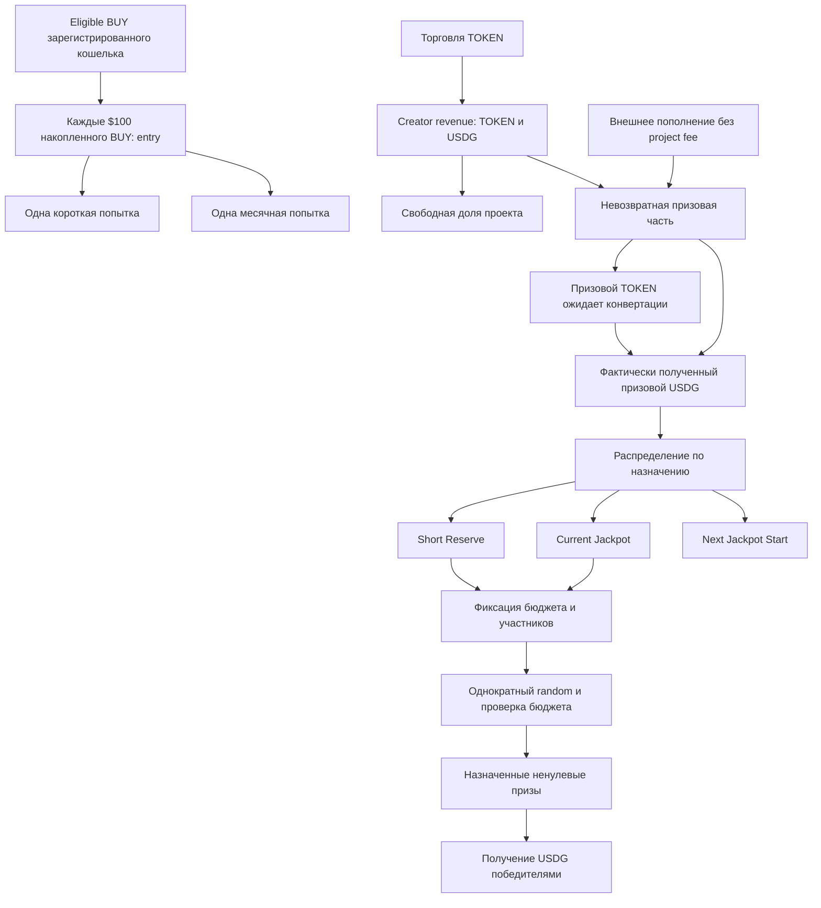

# Promo — актуальные продуктовые правила

Обновлено: 14.09.2026. Владелец принял удаление Short Luck после сравнения моделей. Текущая формула зависит только от entries; основная локальная модель обновлена. Численные настройки остаются экспериментальными, production Short не реализован.

**Главный источник текущих решений.** «Принято» означает согласованную продуктовую логику, а не наличие реализации. «Кандидат» нельзя включать в код как утверждённую настройку. Состояние кода — в [IMPLEMENTATION_STATUS.md](IMPLEMENTATION_STATUS.md). Исторические документы не переопределяют этот файл.

## 1. Назначение и границы

**Принято.** Обычный спекулятивный meme TOKEN и отдельное добровольное Promo. Торговля создаёт creator revenue, допустимые покупки зарегистрированных кошельков создают билеты. Поощрения — короткие розыгрыши и месячный jackpot; физические/спонсорские акции предусмотрены отдельным будущим слоем, их реализация сейчас не проектируется.

Все денежные призы выплачиваются в **USDG**. TOKEN — торговый актив и источник части комиссий, но не призовой номинал.

Система может жить без спонсоров на комиссиях. Нет торговли — нет нового комиссионного дохода; накопленные средства сохраняются. Доходность, окупаемость BUY и обязательная выплата по расписанию не обещаются.

Ограничиваем доминирование **одного зарегистрированного кошелька в одном draw**. Не обещаем cap на человека, за всё время или отрицательное EV любого farming. Несколько кошельков одного человека — принятый остаточный риск MVP; identity/KYC для доказательства уникальности не добавляем. Это не разрешение администратору менять случайный результат.

### Постоянная основа и спонсорские акции

**Принято 14.09.2026:** TOKEN, короткие шестичасовые USDG-розыгрыши и месячный USDG-jackpot образуют собственное постоянное промо токена. Оно не зависит от наличия спонсоров. «Постоянное» означает назначение системы, а не гарантию выплаты на каждом checkpoint: сохраняются условия готовности бюджета, pending и необходимость внешнего исполнителя.

Спонсорские акции подключаются отдельным слоем: дополнительные денежные или физические призы, собственные сроки, условия участия и получения. Их появление, завершение или проблемы с доставкой не блокируют базовые draws и claims, не меняют уже frozen бюджеты и назначенные награды.

- Пополнение основной казны USDG подчиняется существующим GENERAL/targeted правилам и становится невозвратными призовыми средствами без project fee. Этот путь уже предусмотрен funding API.
- Деньги на конкретную спонсорскую акцию и физические призы требуют отдельного учёта. Их нельзя считать свободными Short/Current/Next или обеспечением базовых USDG-призов. Такого API сейчас нет.
- Спонсорский слой может использовать общую историю активности кошелька, но не получает произвольного доступа к основной казне. Подключение акции не означает заменяемый controller, arbitrary calls или универсальные модули в текущем PromoVault.
- Условия дополнительных акций фиксируются до участия и random; новые акции не переписывают обязательства уже начатых. Получение физического приза и необходимые персональные данные обрабатываются отдельно от публичного денежного accounting. Требования отдельной акции не становятся автоматически требованиями участия в базовом промо.

Рабочее направление для будущей спецификации: дополнительное участие не расходует базовые short/monthly attempts, спонсорский выигрыш не меняет правила базового Short. Точное повторное использование активности, согласие с условиями, обеспечение и доставка вещей, проверка личности при необходимости и неисполнение спонсором ещё требуют отдельного дизайна. Сейчас утверждается граница слоёв, а не готовность этих механизмов.

## 2. Общая схема



Прямой путь Prize → USDG относится только к уже поступившему USDG. Призовой TOKEN до обмена не является USDG-резервом.

## 3. Деньги проекта и деньги призов

**Принято:** свободная доля проекта отделяется от creator revenue **до** поступления в призовую часть. Проект может расходовать её на развитие либо добровольно пополнить ею призы. Размер доли пока не утверждён.

После попадания на призовую сторону средства нельзя вывести владельцу/спонсору, вернуть по требованию или переименовать в свободные средства проекта. Их назначение — призы; до выдачи они могут храниться, конвертироваться по правилам и резервироваться. Добровольное пополнение от самого проекта также невозвратно.

RNG, исполнитель транзакций, RPC, сервер и разработка оплачиваются **вне** призового фонда. Контракт не запускается самостоятельно по таймеру: автоматизация потребует исполнителя и отдельного бюджета.

Запрет admin withdrawal не заменяет проверку условий swap и назначения winners: через неправильные обмены или произвольные результаты также можно передать стоимость посторонним. Это требования к будущей реализации, а не уже доказанные свойства всей системы.

## 4. Три призовых резерва и признание поступлений

| Назначение | Смысл |
|---|---|
| Short Reserve | Постоянный запас USDG для коротких розыгрышей |
| Current Jackpot | Накопление главного месячного приза, без верхнего лимита |
| Next Jackpot Start | Обеспеченная основа следующего jackpot cycle, с заданной целью T |

Свободный резерв, зафиксированный бюджет draw и назначенный долг победителю — **разные состояния одних средств**, а не дополнительные деньги. Один USDG не может одновременно финансировать два назначения. Неполученный приз не становится свободным снова.

Поступления не меняют уже зафиксированные призы. Новые средства с назначением Current Jackpot во время ожидания monthly result учитываются отдельно для последующих розыгрышей. Проводка уже определена и реализована: при no-win свободный Current становится A+F, при win — A+T, где A — новые поступления, F — frozen jackpot; подробнее ниже и в PROMO_VAULT_DESIGN.

## 5. Внешнее пополнение — утверждённое распределение

**Принято явно:** внешнее призовое funding без project fee. Автоматическое распределение, без ручного выбора долей администратором для каждого поступления.

### Общее пополнение

Пока Next Start не заполнен, пропорция **3:2:1**:

| Назначение | Доля общего funding |
|---|---:|
| Short | 1/2 = 50% |
| Current | 1/3 = 33⅓% |
| Next | 1/6 = 16⅔%, не выше недостающей суммы |
| Проект | 0% |

Излишек доли Next всегда идёт в Current. После заполнения Next получается **50% Short / 50% Current**.

Для суммы X и свободного Next N при цели T идеальная арифметика:

```text
short = X / 2
next  = min(X / 6, max(T - N, 0))
current = X - short - next
```

Предел Next учитывается внутри пополнения, даже если оно пересекает цель. В реализации raw units распределяются непрерывным циклом SHORT/CURRENT/SHORT/CURRENT/SHORT/NEXT, с сохранением фазы между общими пополнениями. Это точные 3:2:1 на полных группах, а не приближённые 33,33%/16,67%. Микроостатки учитываются сразу, нет отдельной пыли. Дробление при том же порядке операций сохраняет итог; подробности в PROMO_VAULT_DESIGN. Формулы выше — идеальная дробная модель, не floor заново на каждом вызове.

### Целевое пополнение

| Выбранное назначение | Результат |
|---|---|
| Short | Вся сумма в свободный Short |
| Current | Вся сумма в свободный Current, верхнего лимита нет |
| Next | Заполняет только недостающее до T; **весь излишек в Current** |

Пример: Next недостаёт 20 USDG.

- Общее funding 600 → Short 300, Next 20, Current 280.
- Целевое Next funding 600 → Next 20, Current 580.
- Next уже заполнен: общее 600 → Short 300, Current 300; целевое Next 600 → Current 600.

Прямой ERC20 transfer не содержит выбранного назначения. Принято и реализовано: такие USDG transfers распознаются permissionless syncUSDG как GENERAL по опубликованному правилу. Целевое назначение задаётся только fundUSDG; прежние direct transfers синхронизируются до нового целевого transferFrom. Вызывающий sync не объявляется отправителем денег. Поддержка внешнего TOKEN funding с сохранением назначения через последующую конвертацию также ещё не специфицирована. Первый этап — USDG.

### Не путать с creator revenue

Пропорции выше утверждены для **внешних** пополнений. Они не утверждают автоматически предложенные 10% проекта или разделение всех creator fees 10/45/30/15. Доли creator revenue и использование той же 3:2:1 для его призовой части остаются кандидатами.

## 6. Конвертация TOKEN

**Принят порядок:** обмен → фактически полученный USDG → распределение → резервирование обеспеченного draw → random → начисление.

- Призовой TOKEN до обмена — отдельный инвентарь, не обещание USDG по котировке.
- Отдельно фиксируются реальные проданные TOKEN, полученный USDG, средняя фактическая цена и транзакция.
- Неудачный обмен оставляет TOKEN призовыми; ранее накопленный USDG может обслуживать розыгрыш.
- Обмен не обязательно совпадает с шестичасовой проверкой.
- Регулярная продажа TOKEN ради USDG-призов — принятый экономический компромисс.
- Порции, частота, маршрут, минимальный выход и источник допустимой цены ещё не выбраны. Получатель выхода не может произвольно меняться в пользу проекта.

## 7. Билеты и их срок жизни

**Принято:** $100 накопленного eligible BUY = entry, остаток переносится; SELL не отменяет entry, holding не требуется. Каждая entry даёт одну короткую и одну месячную попытку.

Если draw не стартовал, попытки сохраняются. Если случайный выбор состоялся, все участвовавшие попытки соответствующего типа расходуются, включая проигравших, кандидатов без доступного бюджета и случай полного отсутствия победителей. Короткая попытка не расходует месячную.

Рабочая eligibility-основа — зарегистрированный кошелёк, прямой канонический TOKEN/USDG BUY, установленный плательщик и конечный получатель. Точное attribution, оценка $100 в USDG, границы cutoff и rounding ещё требуют спецификации; не заменяем gross BUY на net BUY незаметно.

Предпочтительная организационная схема, пока не полное утверждённое ТЗ:

```text
OPEN: попытки доступны
FROZEN: набор закрыт, попытки заблокированы за draw
FINALIZED: попытки использованы, результат окончательный
```

При freeze открывается следующий набор для новых BUY. Кандидат месячного carry — один OPEN набор с добавлением новых попыток, пока monthly не стартовал, без очереди отдельных месяцев. Безопасное завершение ошибки после freeze ещё не определено; нельзя автоматически возвращать попытки, если это даёт повторный выбор уже известного результата.

## 8. Short: корзина призов, допуск и случайная раздача

**Принято 14.09.** Промежуточный допуск не означает победу. Победитель — только кошелёк, которому назначен конкретный ненулевой обеспеченный USDG-приз. «Колесо» было образом для объяснения, не требованием к алгоритму или UI.

1. На допустимом шестичасовом checkpoint проверяем готовность бюджета и билетов, если нет pending short. Не готово → пропуск без расходования попыток. После settlement следующий short допустим не ранее чем через 6 часов; подробности ниже.
2. До random фиксируем бюджет D из свободного Short, обеспеченную корзину ненулевых USDG-призов, участников, entries и версию правил. Сумма корзины не выше D. Корзина строится по фиксированным целым весам, как описано ниже.
3. По вероятности допуска с учётом entries определяем прошедшие кошельки.
4. Случайно и без предпочтения по времени действий перемешиваем прошедшие кошельки и корзину призов.
5. Сопоставляем их по порядку: максимум один приз кошельку за short. K призов и M допущенных дают min(K,M) победителей.
6. Призов не хватило → оставшиеся кандидаты не выиграли. Кандидатов меньше, чем призов → оставшиеся деньги сохраняются. Никто не прошёл → нет победителей.
7. Окончательно назначаем обеспеченные призы, расходуем участвовавшие короткие попытки. Месячные попытки от этого не расходуются.

Мы готовы раздать **весь выделенный D**, если кандидатов достаточно и корзина использует весь D. Это не весь Short Reserve. Обязательного случайного SpendFactor, удерживающего часть D, больше не требуется. Технический остаток построения корзины/округления сохраняется в Short. Уже назначенный приз не уменьшается; Claim только получает существующий долг и не влияет на очередь.

Пример: K=10, допущены 30 кошельков → случайная очередь выбирает 10 победителей; остальные 20 не получают приз. Допущены 3 → случайно выдаются 3 приза из корзины, остальные суммы остаются в Short. Entries на втором этапе **не добавляют повторный вес**.

Это заменяет прежний кандидат «сгенерировать каждому сумму и проверить остаток», а также старую схему SpendFactor + нормализованные веса. Численные веса, число призов и минимальный приз пока не выбраны; способ построения корзины принят. Не требуется заранее обеспечить приз каждому потенциально допущенному кошельку.

### Построение корзины — принято 14.09

В версии правил фиксируем непустой список положительных целых весов `weights=[w1,...,wK]` и положительный минимум `m`. Все суммы считаются в минимальных единицах USDG, без floating point.

```text
sumW = sum(weights)
unit = floor(D / sumW)
если unit < m: draw not ready
prize_i = unit * wi
basketTotal = unit * sumW
remainder = D - basketTotal
```

Каждый приз не меньше m, сумма корзины не превышает D, округление однозначно. Остаток построения и невыданные призы остаются в Short; frozen/claimable средства других draws не участвуют. Порог `unit >= m` применяется именно к базовой единице, поэтому может быть строже проверки самого маленького приза при всех весах больше единицы.

При фиксированном шаблоне рост D увеличивает суммы призов, **не число призовых мест K**. Если допущенных меньше K, выдаётся случайное подмножество корзины: крупный приз может как выпасть, так и остаться в резерве. Способ выбора D и конкретные K, веса, m ещё открыты. Версия и готовая корзина фиксируются до random и не меняются по его результату.

## 9. Допуск без Luck и порядок draws

**Принято 14.09:** Short Luck удалён. История проигрышей или выигрышей не создаёт бонусов или штрафов. При одинаковом количестве участвующих entries новичок и постоянный кошелёк имеют одинаковые условия. Счётчик Luck, начисление и сброс не входят в текущую state machine. Причина решения и историческое сравнение — в [SHORT_LUCK_REVIEW](SHORT_LUCK_REVIEW.md).

```text
q(e) = p_max * e / (e + h_e)
q(0) = 0
0 < p_max < 1; h_e > 0
```

Больше entries повышает допуск с убывающей отдачей. Рабочий вариант для дальнейших опытов p_max=40%, h_e=1 даёт 20% при одном билете; это не утверждённые production-настройки. Минимальный размер награды, K, веса и выбор D также пока экспериментальные.

Допуск не означает победу: при дефиците мест честная случайная раздача даёт min(K,M) победителей, без дополнительного веса за entries. Cap допуска ограничивает и вероятность приза кошелька в одном draw; не ограничивает множество кошельков или суммарную вероятность за множество draws. Нет гарантии выигрыша, компенсации прошлых проигрышей или reroll.

Минимальный snapshot: участники, их short attempts/entries, бюджет, корзина и версия правил. Settlement назначает обеспеченные призы и однократно расходует все участвовавшие short attempts; месячные попытки не затрагиваются. Получение через Claim не меняет результат. Где хранятся и как доказываются entries/участники — отдельный технический дизайн; удаление Luck не решает эту задачу и не доказывает gas-доступность большого draw.

Один pending short на всю систему. Пока он ожидает результата, новые attempts копятся в следующем OPEN. Следующий freeze только после завершения предыдущего draw и расхода его попыток, не ранее чем через 6 часов после settlement. Неготовность сохраняет попытки. Пропущенные checkpoints не создают очередь/replay. Funding, claims и monthly могут продолжаться независимо. Недоставленный RNG не означает no-win; recovery и точный механизм запуска по готовности ещё требуют спецификации.

## 10. Monthly и следующий старт

**Принято:** раз в месяц проверяем готовность; текущий jackpot разыгрывается только после обеспечения следующего старта до цели T. Обязательной ежемесячной выплаты нет. Current может расти без верхнего лимита. Next не поглощает излишки сверх цели: они идут в Current.

Кандидат random: допуск кошельков с q_month(e), затем один равномерно выбранный победитель среди допущенных, без повторного веса за entries. Нет допущенных → нет победителя.

- Win: зафиксированный текущий приз становится долгом победителю; следующий старт становится основой нового Current; начинается накопление нового Next.
- No win: текущие призовые деньги и следующий старт сохраняются.
- При состоявшемся random участвовавшие месячные попытки использованы в обоих случаях.
- Claim не определяет начало следующего цикла. Неполученный выигрыш остаётся долгом, не пополняет следующий draw.

Подтверждено владельцем в ревью commit 4bb9485: T=100 USDG на весь экземпляр и все MVP cycles, без изменения target/schedule. При реальном USDG deployment должен задавать 100000000 raw units (6 decimals). Bootstrap текущего приза обеспечивается реальным funding; target не создаёт средства.

Продуктовая цель: jackpot главный приз. Ограничение короткого D относительно Current J **в момент freeze** — кандидат. Оно не означает ретроактивного пересчёта D после выигрыша jackpot. Последовательность short/monthly и обращение с новыми Current-поступлениями во время pending нужно завершить в state machine. FeeRouter campaign, jackpot cycle и набор monthly attempts — разные понятия.

## 11. Предложения чисел — НЕ утверждённые настройки

Этот список сохранён, чтобы прежние примеры не превратились в требования по ошибке.

| Параметр | Последнее предложение, требует принятия |
|---|---|
| Creator revenue | 10% project / 45% short / 30% current / 15% next; после заполнения next — 10/45/45/0 |
| Short exposure | min(10% свободного Short, 10% Current) |
| Корзина short | Число и суммы призов не выбраны; прежние 5%/15%/50% с вероятностями 70%/25%/5% были предложением другой модели, не готовой корзиной |
| Минимальный prize | 1 USDG был предложением; минимальный D нужно выбрать вместе с новой корзиной |
| Short q | Прежние p_max=40%, h=3 были примером; для текущих опытов p_max=40%, h_e=1; production-параметры не утверждены |
| Monthly q | p_max=20%, h=3 |
| Минимум участников | Предложено убрать старые 30 entries и требовать хотя бы один wallet; не утверждено |

**Уже утверждённые** 3:2:1 для внешнего funding, 50:50 после наполнения Next и перевод излишков в Current находятся в разделе 5, а не в этой таблице.

## 12. Следующий этап и оставшиеся решения

Первый этап реализован в локальном PromoVault: USDG общее/целевое пополнение, предел Next и overflow в Current, отсутствие project fee с внешних денег и изоляция свободных средств от reserved/claimable. Существующие reserve/finalize адаптированы бухгалтерски; логика random не добавлялась.

API, direct transfers, rounding и связь с reserve/finalize описаны в [PROMO_VAULT_DESIGN](PROMO_VAULT_DESIGN.md). T положителен и immutable при развёртывании. Next нельзя потратить напрямую; реализован перенос в Current исключительно внутри monthly win. Start сам синхронизирует и фиксирует весь Current; settle синхронизирует новые поступления до перехода и сохраняет A: no-win даёт A+F, win даёт A+T и отдельный claimable F. GENERIC finalize для MONTHLY запрещён. Календарь/RNG/attempts остаются вне этого бухгалтерского этапа. Три recipients FeeRouter не являются тремя новыми призовыми резервами.

Следующие продуктовые решения: creator shares, выбор D, численные K/weights/m и readiness, параметры p_max/h_e и прочие версии правил. Формула допуска, построение корзины и один pending short уже приняты. Локальная модель и первые проверки конкуренции/округления реализованы в SHORT_MODEL. Перед production-кодом остаются сравнение настроек на нескольких seeds, оценка худшего размера settlement и спецификация источника истины participants/entries и controller. T и отсутствие replay пропущенных monthly подтверждены. Технические отдельные задачи: conversion, indexer, RNG/state machine, обработка задержек, проверка масштабов draw. Frontend и физические призы — позже. Публичного запуска нет.

## 13. Направление trust/mutability — обсуждение 13.09

Поддержано направление: неизменяемы ограничения полномочий и уже возникшие обязательства, а параметры фиксированных алгоритмов могут версионироваться для будущих периодов. Это не разрешение на произвольную замену кода controller или внедрение proxy. Точная архитектура/полномочия активации пока обсуждаются, код этим разделом не менялся.

- Просто запретить withdraw недостаточно: произвольный новый controller/module способен направить старый free balance владельцу под видом приза. Версия только для новых draws сама по себе этот обход не закрывает.
- Предпочтительный кандидат — стабильные custody и проверка draw плюс ограниченные версии параметров. Проверка участников и random остаётся отдельной необходимой границей доверия.
- Для всего MVP принято T=100 USDG на все циклы экземпляра, без смены target и pending schedule. Это исключение из обсуждения версионирования параметров, а не открытый вопрос.
- Новые настройки не переписывают открытое/замороженное участие. При смене порога entry нужно учесть также накопленный BUY carry, не только готовые билеты.
- Простой кандидат monthly: старый OPEN остаётся на старых правилах, обновление ждёт нового набора. Задержка обновления — явный компромисс.
- Версии параметров не исправляют произвольный баг неизменяемого исполняемого кода. Универсального безопасного recovery пока не выбрано.
- Запрет возврата prize funds — запрет административного вывода/refund/переклассификации; он не доказывает невозможность выигрыша скрытого связанного кошелька без identity. Операционный контроль времени снимка также требует заданных cutoff/checkpoint.

Текущие вопросы и сценарии ревью — в [постоянном обращении к GPT](GPT_REVIEW_REQUEST.md). Его ответы остаются предложениями до принятия.

### Последующее упрощение, 13.09

Владелец поддержал 100 USDG как минимальный следующий старт и попросил избегать лишних условий вокруг паузы и target. Подтверждено последующим ревью (commit 4bb9485): **T=100 USDG на весь MVP, без pending target/schedule; административная pause не добавляется**. Он заменяет направление обсуждения изменяемого T для следующего цикла; monthly accounting реализован следующим этапом; production random и расписание не реализованы. Constructor прототипа всё ещё принимает произвольный положительный T.

Принято и реализовано в accounting: no-win возвращает frozen jackpot в Current и сохраняет Next; win назначает frozen сумму в claimable и переносит Next в Current, сохраняя новые поступления после freeze. Все участвовавшие месячные попытки расходуются при состоявшемся random; при недоставленном результате остаются pending, не объявляются проигравшими. Порядок перехода и sync описан в PROMO_VAULT_DESIGN; расход попыток ещё не реализован. 100 USDG старта не означает изменение отдельного правила $100 BUY за entry.


### Уточнение monthly после ревью и реализации

Один pending monthly. Freeze учитывает direct USDG до снятия всего Current в F. Settlement учитывает direct USDG пока старый Next полон, затем атомарно возвращает F (no-win) либо назначает F победителю и переносит T в Current (win). Порядок sync сохраняет единое значение границы; фаза funding не сбрасывается. Во время pending обычный CURRENT reserve запрещён, SHORT продолжает работать.

Подтверждённое календарное правило: прошедшие во время pending checkpoints не создают очередь/replay; после settlement следующий допустимый monthly — через один обычный monthly interval. **Контракт данного этапа это время не проверяет**: оно относится к будущему production controller. Точная длительность/календарная интерпретация interval должна быть явно задана в его спецификации. No-win не равен timeout; недоставленный исход не завершает draw автоматически.
