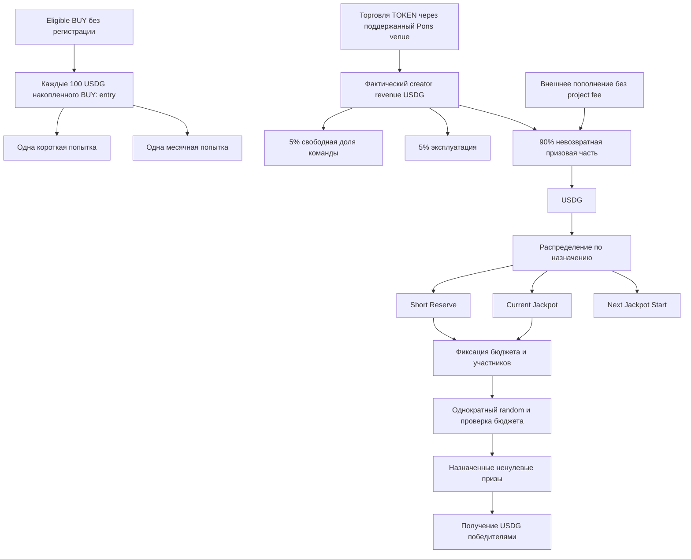

# Promo — актуальные продуктовые правила

Активный план первого выпуска: [Pons и границы резерва PAIR](ACTIVE_RELEASE_PATH.md). Уточнение01.10 отделяет реализации; порог, математика и распределение не меняются.

**RNG, принято владельцем 27.09:** для MVP допускается drand с явно операционной проверкой свежести времени и состояния сети перед новым freeze. При сомнениях worker ждёт; это не контрактная гарантия финальности и не защита от всех глубоких reorg. Один закреплённый round/result, без повторного выбора; задержка доставки не позволяет reroll. Новый admin/замена RNG не добавляются. Конкретные timing thresholds и публичный deployment ещё не утверждены. [Реализация и пределы](DRAND_ADAPTER.md).

**Решение 27.09, пакет автоматических билетов Infinity:** для нового deployment участие не требует регистрации. Поддержанный BUY учитывает фактическое списание USDG покупателя, включая комиссии, за вычетом возвратов этой же транзакции. Payer = recipient = отправитель прямого вызова проверенного adapter; неоднозначные маршруты не учитываются. 100 nominal USDG дают entry, остаток переносится. Продажа не создаёт и не отменяет entry. Это новая genesis policy; история V2 и её registration gate не меняются. Охват реализации — в [INFINITY_BUY](INFINITY_BUY.md).

**Первый релиз — решение 30.09:** адаптация под Pons V2; PAIR Infinity сохраняется как резервная интеграция. creator policy fee **3% (300bps)**; protocol/pool/router fees отдельно. Фактический creator revenue распределяется **90% призам / 5% operations / 5% команде** (принято 28.09). V1/V2 — legacy-интеграции, не альтернативные правила участия текущего релиза.

Обновлено: 28.09.2026. Здесь действующие продуктовые решения. История до консолидации — [снимок](archive/snapshots/PRODUCT_SPEC_BEFORE_INFINITY_CONSOLIDATION_2026-09-28.md). Код и пределы проверок — в [IMPLEMENTATION_STATUS](IMPLEMENTATION_STATUS.md), текущая работа — в [CURRENT_CONTEXT](CURRENT_CONTEXT.md).

**Главный источник текущих решений.** «Принято» означает согласованную продуктовую логику, а не наличие реализации. «Кандидат» нельзя включать в код как утверждённую настройку. Состояние кода — в [IMPLEMENTATION_STATUS.md](IMPLEMENTATION_STATUS.md). Исторические документы не переопределяют этот файл.

## Решение 01.10: поэтапное пополнение через Pons

Владелец поддержал отдельную публичную страницу статуса и ограничений: раскрываем
конкретные зависимости/задержки, дату проверки и проверяемые адреса/транзакции.
Отличаем подтверждённое от неизвестного; статическая страница не выдаётся за live
мониторинг. Раскрытие ограничений не заменяет техническую проверку.

Собираем доступные комиссии и распределяем фактически полученные USDG по принятой
схеме90/5/5. Pending TOKEN и несобранные комиссии не входят в доступный призовой
бюджет. Недоступные операции ждут и повторяются после проверки состояния; заведомо
неуспешные транзакции ради повторения не отправляем. На старте допустим ручной или
полуручной запуск того же безопасного пути, затем планировщик. Полная независимость
от Pons не обязательна для разработки. Ручной режим не обходит on-chain permissions;
frozen/claimable и обеспеченные выплаты не зависят от новых поступлений.

## 1. Назначение и границы

Текущее направление первого выпуска — Pons V2; перенос начат, ещё не допущен к публичному запуску. Специфические разделы Infinity ниже описывают сохранённую реализацию PAIR, а не готовый охват Pons. Название интерфейса покупки не определяет eligibility: билет создаёт доказанный BUY по опубликованному decoder. Старые правила V1 AUTO и V2 registration описаны отдельно в разделе 7 и не применяются к новому экземпляру.

**Уточнение 24.09.2026:** промо также должно приводить подтверждённых покупателей
TOKEN на сайт с информацией о розыгрышах и получением наград. Стремимся расширять
проверяемый охват покупок из разных интерфейсов, но не обещаем билеты всем
держателям. Неоднозначную покупку не засчитываем; сам Transfer/остаток TOKEN не
является основанием начисления. Новые маршруты требуют отдельного допуска.
Игры, новости и магазин на сайте пока идеи, не обязательства текущего MVP.
Позиционирование как промо сайта не устанавливает юридическую квалификацию;
допустимость запуска/рекламы в конкретной стране отдельно не подтверждена.

**Расширения BUY, принято 24.09.2026:** новый способ доказать ту же покупку можно
добавлять версионированным адаптером с будущей публичной активацией. Подготовленный
выпуск индексера предшествует объявлению; отдельный реестр кандидатов не нужен.
Иное основание начисления, правило оценки объёма или бенефициар требует отдельного
решения о поколении правил. Старые покупки/frozen не пересчитываются. Не обещаем
покрытие любого маршрута или безошибочность объявителя; ограничения и отказы
должны быть видимы, сомнение не превращается в начисление по догадке.

**Принято 17.09.2026 — два фиксированных контроллера.** Short и Monthly имеют
отдельные immutable полномочия над общей USDG-казной. Short расходует только Short,
Monthly выполняет только jackpot cycle; старые credits и денежная математика общие
и сохраняются. Замена controllers, proxy, withdrawal и emergency reset не добавляются.
Это архитектура нового deployment, не миграция прежних обязательств.
[Реализация, измерения и ограничения](DUAL_CONTROLLER_ARCHITECTURE.md).

Техническое уточнение: ID Short и Monthly имеют непересекающиеся пространства,
проверяемые контрактами до публикации и при резервировании. Один тип не может
занять идентификатор другого даже до freeze. Это не меняет призы, шансы или расход билетов.

**Принято 15.09.2026 — воспроизводимый запуск.** PAIR является первой интеграцией, а не обязательной платформой всех будущих экземпляров продукта. Ядро Promo должно допускать независимое повторное развёртывание на другой совместимой площадке с адаптацией источника комиссий и явно объявленных правил финансирования. Это не перенос старой ликвидности, балансов или обязательств и не основание добавлять вывод призовой казны либо изменяемость уже развёрнутых контрактов. Техническая граница и предложенный план: [переносимость и исходники PAIR](archive/studies/PAIR_PORTABILITY_AND_SOURCES_2026-09-15.md).

**Принято.** Обычный спекулятивный meme TOKEN и отдельное добровольное Promo. Торговля создаёт creator revenue, допустимые покупки кошельков автоматически создают билеты без регистрации. Поощрения — короткие розыгрыши и месячный jackpot; физические/спонсорские акции предусмотрены отдельным будущим слоем, их реализация сейчас не проектируется.

Все денежные призы выплачиваются в **USDG**. TOKEN — торговый актив и источник части комиссий, но не призовой номинал.

**Уточнено пользователем 25.09:** автоматические небольшие продажи TOKEN постепенно
накапливают USDG по GENERAL, без спекулятивной стратегии и обязательного исторического
oracle. Одна продажа не обязана закрыть Short target; наполненный Short не выключает
финансирование Current/Next. Назначенному executor доверено выбирать minOut; это явная
ценовая власть, ограниченная объёмом продаж, а не гарантия справедливого курса.
Бюджет и призы опираются на фактический USDG; при недостаче накопление продолжается.
Точный курс/сумма не обещаются. На сайте показывается фактическая транзакция.
Временные и прочие gates сохраняются. [Подробности и границы](CONVERSION_TRIGGER.md).

Система может жить без спонсоров на комиссиях. Нет торговли — нет нового комиссионного дохода; накопленные средства сохраняются. Доходность, окупаемость BUY и обязательная выплата по расписанию не обещаются.

Ограничиваем доминирование **одного кошелька в одном draw**. Не обещаем cap на человека, за всё время или отрицательное EV любого farming. Несколько кошельков одного человека — принятый остаточный риск MVP; identity/KYC для доказательства уникальности не добавляем. Это не разрешение администратору менять случайный результат.

### Постоянная основа и спонсорские акции

**Принято 14.09.2026:** TOKEN, короткие шестичасовые USDG-розыгрыши и месячный USDG-jackpot образуют собственное постоянное промо токена. Оно не зависит от наличия спонсоров. «Постоянное» означает назначение системы, а не гарантию выплаты на каждом checkpoint: сохраняются условия готовности бюджета, pending и необходимость внешнего исполнителя.

Спонсорские акции подключаются отдельным слоем: дополнительные денежные или физические призы, собственные сроки, условия участия и получения. Их появление, завершение или проблемы с доставкой не блокируют базовые draws и claims, не меняют уже frozen бюджеты и назначенные награды.

- Пополнение основной казны USDG подчиняется существующим GENERAL/targeted правилам и становится невозвратными призовыми средствами без project fee. Этот путь уже предусмотрен funding API.
- Деньги на конкретную спонсорскую акцию и физические призы требуют отдельного учёта. Их нельзя считать свободными Short/Current/Next или обеспечением базовых USDG-призов. Такого API сейчас нет.
- Спонсорский слой может использовать общую историю активности кошелька, но не получает произвольного доступа к основной казне. Подключение акции не означает заменяемый controller, arbitrary calls или универсальные модули в текущем PromoVault.
- Условия дополнительных акций фиксируются до участия и random; новые акции не переписывают обязательства уже начатых. Получение физического приза и необходимые персональные данные обрабатываются отдельно от публичного денежного accounting. Требования отдельной акции не становятся автоматически требованиями участия в базовом промо.

Рабочее направление для будущей спецификации: дополнительное участие не расходует базовые short/monthly attempts, спонсорский выигрыш не меняет правила базового Short. Точное повторное использование активности, согласие с условиями, обеспечение и доставка вещей, проверка личности при необходимости и неисполнение спонсором ещё требуют отдельного дизайна. Сейчас утверждается граница слоёв, а не готовность этих механизмов.

## 2. Общая схема

Технические ограничения переносимости и актуальный план для независимых deployments:
[самопроверка и network profiles](LOCAL_REVIEW_AND_PORTABILITY.md). Этот план не меняет
номинал призов, custody или правила уже существующего deployment.


```mermaid
flowchart TD
    Trade[Торговля TOKEN через поддержанный Pons venue] --> Fees[Фактический creator revenue USDG]
    Buy[Eligible BUY без регистрации] --> Entry[Каждые 100 USDG накопленного BUY: entry]
    Entry --> ShortTry[Одна короткая попытка]
    Entry --> MonthTry[Одна месячная попытка]
    Fees --> Project[5% свободная доля команды]
    Fees --> Ops[5% эксплуатация]
    Fees --> Prize[90% невозвратная призовая часть]
    External[Внешнее пополнение без project fee] --> Prize
    Prize --> USDG
    USDG --> Allocate[Распределение по назначению]
    Allocate --> S[Short Reserve]
    Allocate --> J[Current Jackpot]
    Allocate --> N[Next Jackpot Start]
    S --> Draw[Фиксация бюджета и участников]
    J --> Draw
    Draw --> Result[Однократный random и проверка бюджета]
    Result --> Debt[Назначенные ненулевые призы]
    Debt --> Claim[Получение USDG победителями]
```

Схема относится к текущему направлению Pons. В бюджет входит только полученный USDG; TOKEN до конвертации не является USDG-резервом. PAIR/Infinity ниже сохранён как резерв, а не активный launch route.

## 3. Деньги проекта и деньги призов

**Принято:** свободная доля проекта отделяется от creator revenue **до** поступления в призовую часть. Проект может расходовать её на развитие либо добровольно пополнить ею призы. 28.09.2026 принято распределение фактического creator revenue: **90% призам / 5% на эксплуатацию / 5% свободная доля команды**. В Infinity это slots0/1/2 и bps9000/500/500. Эксплуатационный EOA получает USDG и оплачивает газ после конверсии либо из заранее внесённого ETH; призовой vault на газ не расходуется. Эти доли не обещают самоокупаемость: дорогой газ/нехватка ETH означают ожидание с последующим продолжением. Внешнее призовое funding не облагается этими долями.

После попадания на призовую сторону средства нельзя вывести владельцу/спонсору, вернуть по требованию или переименовать в свободные средства проекта. Их назначение — призы; до выдачи они могут храниться, конвертироваться по правилам и резервироваться. Добровольное пополнение от самого проекта также невозвратно.

RNG, исполнитель транзакций, RPC, сервер и разработка оплачиваются **вне** призового фонда. Контракт не запускается самостоятельно по таймеру: автоматизация потребует исполнителя и отдельного бюджета.

Запрет admin withdrawal не заменяет проверку условий swap и назначения winners: через неправильные обмены или произвольные результаты также можно передать стоимость посторонним. Это требования ко всей связке; наличие отдельных проверок не доказывает безопасность всего публичного deployment.

**Решение 24.09:** swap adapter можно заменять по публичному объявлению с задержкой.
TOKEN→USDG, призовой destination и обязательные проверки цены/лимитов не меняются
вместе с adapter. Нет admin вывода или emergency bypass; при невозможности безопасного
обмена TOKEN ждёт, уже имеющийся USDG можно направить в казну независимо.
Burn — отдельная неутверждённая будущая функция, сейчас не реализуется.
Механизм и ограничения: [scheduled converter](SCHEDULED_PRIZE_CONVERTER.md).

## 4. Три призовых резерва и признание поступлений

| Назначение | Смысл |
|---|---|
| Short Reserve | Постоянный запас USDG для коротких розыгрышей |
| Current Jackpot | Накопление главного месячного приза, без верхнего лимита |
| Next Jackpot Start | Обеспеченная основа следующего jackpot cycle, с заданной целью T |

Свободный резерв, зафиксированный бюджет draw и назначенный долг победителю — **разные состояния одних средств**, а не дополнительные деньги. Один USDG не может одновременно финансировать два назначения. Неполученный приз не становится свободным снова.

Поступления не меняют уже зафиксированные призы. Новые средства с назначением Current Jackpot во время ожидания monthly result учитываются отдельно для последующих розыгрышей. Проводка уже определена и реализована: при no-win свободный Current становится A+F, при win — A+T, где A — новые поступления, F — frozen jackpot; подробнее ниже и в PROMO_VAULT_DESIGN.

## 5. Внешнее пополнение — утверждённое распределение

**Принято явно:** внешнее призовое funding без project fee. Автоматическое распределение, без ручного выбора долей администратором для каждого поступления.

### Общее пополнение

Пока Next Start не заполнен, пропорция **3:2:1**:

| Назначение | Доля общего funding |
|---|---:|
| Short | 1/2 = 50% |
| Current | 1/3 = 33⅓% |
| Next | 1/6 = 16⅔%, не выше недостающей суммы |
| Проект | 0% |

Излишек доли Next всегда идёт в Current. После заполнения Next получается **50% Short / 50% Current**.

Для суммы X и свободного Next N при цели T идеальная арифметика:

```text
short = X / 2
next  = min(X / 6, max(T - N, 0))
current = X - short - next
```

Предел Next учитывается внутри пополнения, даже если оно пересекает цель. В реализации raw units распределяются непрерывным циклом SHORT/CURRENT/SHORT/CURRENT/SHORT/NEXT, с сохранением фазы между общими пополнениями. Это точные 3:2:1 на полных группах, а не приближённые 33,33%/16,67%. Микроостатки учитываются сразу, нет отдельной пыли. Дробление при том же порядке операций сохраняет итог; подробности в PROMO_VAULT_DESIGN. Формулы выше — идеальная дробная модель, не floor заново на каждом вызове.

### Целевое пополнение

| Выбранное назначение | Результат |
|---|---|
| Short | Вся сумма в свободный Short |
| Current | Вся сумма в свободный Current, верхнего лимита нет |
| Next | Заполняет только недостающее до T; **весь излишек в Current** |

Пример: Next недостаёт 20 USDG.

- Общее funding 600 → Short 300, Next 20, Current 280.
- Целевое Next funding 600 → Next 20, Current 580.
- Next уже заполнен: общее 600 → Short 300, Current 300; целевое Next 600 → Current 600.

Прямой ERC20 transfer не содержит выбранного назначения. Принято и реализовано: такие USDG transfers распознаются permissionless syncUSDG как GENERAL по опубликованному правилу. Целевое назначение задаётся только fundUSDG; прежние direct transfers синхронизируются до нового целевого transferFrom. Вызывающий sync не объявляется отправителем денег. Поддержка внешнего TOKEN funding с сохранением назначения через последующую конвертацию также ещё не специфицирована. Первый этап — USDG.

### Не путать с creator revenue

Внешние пополнения целиком призовые. Creator revenue сначала делится по принятой схеме 90/5/5; призовой slot0 поступает в vault и распознаётся как GENERAL. Для этой призовой части действует тот же цикл 3:2:1 и overflow Next → Current. Старые варианты 10/90 и 10/45/30/15 не являются настройками первого релиза.

## 6. Конвертация TOKEN — для источников, которым она нужна

Сохранённый резервный Infinity TOKEN/USDG профиль получает creator revenue в USDG и не требует призового TOKEN→USDG обмена. Отдельный USDG→ETH обмен эксплуатационной доли не использует призовые резервы. Следующие правила сохраняются для источников с TOKEN, а не добавляют обязательную конвертацию в первый релиз.

**Принят порядок:** обмен → фактически полученный USDG → распределение → резервирование обеспеченного draw → random → начисление.

- Призовой TOKEN до обмена — отдельный инвентарь, не обещание USDG по котировке.
- Отдельно фиксируются реальные проданные TOKEN, полученный USDG, средняя фактическая цена и транзакция.
- Неудачный обмен оставляет TOKEN призовыми; ранее накопленный USDG может обслуживать розыгрыш.
- Обмен не обязательно совпадает с шестичасовой проверкой.
- Регулярная продажа TOKEN ради USDG-призов — принятый экономический компромисс.
- Порции, частота, маршрут, минимальный выход и источник допустимой цены ещё не выбраны. Получатель выхода не может произвольно меняться в пользу проекта.

## 7. Билеты и их срок жизни

### Проверяемый собственный indexer — принято 15.09

Собственный indexer — постоянная архитектура, а не временная заглушка. Его код и правила расчёта публикуются; независимый проверяющий должен иметь возможность восстановить eligible BUY, carry и расход попыток из публичных исходных данных через собственный RPC, без доступа к нашей базе.

Для текущего Pons deployment регистрация не нужна. Eligible BUY автоматически попадает в ledger; посещение сайта и register() не являются условиями начисления. Registry остаётся привязкой домена контрактов, но его регистрационные события не дают и не отнимают eligibility в этой policy. См. [INFINITY_BUY](INFINITY_BUY.md).

Для каждого draw публикуется полный воспроизводимый пакет: границы и хеши блоков, участники/попытки, учтённые покупки и carry, связь с предыдущими draws, бюджет/корзина/версия правил. Данные должны быть доступны для скачивания и независимого хранения. До random контракт фиксирует неизменяемое обязательство по снимку (например, Merkle root), бюджет и правила.

Независимая проверка должна находить как добавленные, так и пропущенные покупки/билеты, а затем проверять результат и выплаты. Пересчёт хеша файла от нашего сервера недостаточен. Indexer не получает право произвольно назначать winners/amounts; контроллеры проверяют результат по закреплённому снимку и random; это не доказывает полноту списка покупок.

**Принятая граница доверия:** наша подпись подтверждает авторство снимка, не его истинность. Публичность и воспроизводимость позволяют обнаружить неправильный снимок, но не гарантируют блокировку выплаты по нему. Merkle proof доказывает включение записи, не правильность и полноту исходного списка. Не обещаем отсутствие влияния команды; независимые подтверждения, challenge или proof of computation пока не реализуем. Границы реализованных snapshot/cutoff/RNG и оставшиеся условия публичного запуска указаны в карте реализации; доверие к полноте публикации этим не устранено. Подробные требования: [INDEXER_TRUST_MODEL](INDEXER_TRUST_MODEL.md).

### Начисление и расход попыток

**Принято:** 100 USDG накопленного eligible BUY = entry, остаток переносится; SELL не отменяет entry, holding не требуется. Каждая entry даёт одну короткую и одну месячную попытку. Уточнение 15.09, подтверждённое владельцем в ревью `f421083`: это **100 USDG nominal**, без пересчёта рыночного курса USDG к USD и без ценового оракула. При 6 decimals порог равен 100000000 raw units.

Если draw не стартовал, попытки сохраняются. Если случайный выбор состоялся, все участвовавшие попытки соответствующего типа расходуются, включая проигравших, кандидатов без доступного бюджета и случай полного отсутствия победителей. Короткая попытка не расходует месячную.

### Поддержанный BUY текущего Pons направления

Прямой curve BUY и узкий Universal Router v4 route проверяются отдельными Pons decoders; учитываются фактическое списание USDG и возвраты, payer/recipient и settlement. Произвольный агрегатор или wallet batching не допускается по названию интерфейса. Охват и ограничения: [Pons curve](PONS_BUY.md), [Pons v4](PONS_V4_BUY.md). Публикация точного manifest/routes предшествует участию; локальный PASS не является публичным допуском.

### Резерв PAIR: поддержанный BUY Infinity

Прямой `executeExactInput` проверенного adapter, один TOKEN/USDG pool, `payer = recipient = tx.from`. Засчитывается фактический net debit USDG, включая комиссии и за вычетом возврата этой же транзакции; gas не входит. Pool deltas, calldata и ERC20 settlement проверяются вместе. Exact-output, посредники, иные quote assets, простой transfer/holding и неоднозначные routes не дают entries.

Список поддержанных интерфейсов нельзя вывести из их названия. До публичного обещания нужны receipts фактического маршрута UI и результат decoder. Сайт показывает проверенный путь, условия, исключённые сделки с причинами и будущие активации. Не обещаем «любой BUY даёт билет».

### Legacy PAIR V1/V2 — не правила текущего Pons релиза

Старые genesis policies сохраняют требование регистрации до покупки и прежнюю базу gross quote. Для V2 direct это канонический Universal Router exact-input single swap; для отдельно допущенного V1 AUTO — gross debit составной покупки по своим правилам. Подробности: [DIRECT_BUY_REPLAY](DIRECT_BUY_REPLAY.md), [ROUTE_RESEARCH](ROUTE_RESEARCH_2026-09-24.md). Их ledger не переводится в automatic задним числом, новые Infinity receipts по ним не классифицируются.

Общая схема попыток (независима от поколения BUY policy):

```text
OPEN: попытки доступны
FROZEN: набор закрыт, попытки заблокированы за draw
FINALIZED: попытки использованы, результат окончательный
```

При freeze открывается следующий набор для новых BUY. Месячные попытки копятся в одном OPEN наборе с добавлением новых попыток, пока monthly не стартовал, без очереди отдельных месяцев. Безопасное завершение ошибки после freeze ещё не определено; нельзя автоматически возвращать попытки, если это даёт повторный выбор уже известного результата.

**Учёт попыток и cutoff, 15.09:** cutoff задаёт последний полностью включённый канонический блок с номером/хешем, строго раньше блока FREEZE. Новый cutoff того же типа не может предшествовать блоку его предыдущего TERMINAL. Снимок включает все доступные к cutoff попытки; BUY после cutoff, даже если он произошёл до публикации FREEZE, остаётся в следующем OPEN. Short и Monthly имеют независимые состояния и по одному pending draw. Диапазоны попыток пересчитываются из покупок и прошлых списаний, а не задаются оператором.

После каждого перехода сохраняется `minted = open + frozen + consumed` по каждому типу. Terminal win и no-win расходуют один и тот же frozen набор; Claim ничего не меняет. Повторная доставка события идемпотентна, повторный отдельный on-chain переход конфликтует. Reorg пересчитывается по новой ветке; сохранившийся commitment с неправильным cutoff/snapshot вызывает остановку, не молчаливую замену.

Реализация и формат — [ATTEMPT_LIFECYCLE](ATTEMPT_LIFECYCLE.md). Это проверка бухгалтерии и соответствия снимка истории. Тестовый terminal event не доказывает честный random или денежный settlement; выбор момента запуска, finality, шестичасовое правило, бюджет и проверка исхода относятся к связке worker/controller; readiness публичного deployment проверяется отдельно. Хеш попыток не заменяет полный commitment бюджета/корзины/правил.

**Принято владельцем после расчёта 28.09:** верхнего продуктового потолка Short нет.
Бюджет — весь свободный Short на закреплённом блоке подготовки; поздние поступления
не меняют опубликованный бюджет. Frozen и claimable исключены. Контрактный maxBudget
для нового профиля равен uint256.max, а не1000USDG; legacy экземпляры не изменяются.

## 8. Short: корзина призов, допуск и случайная раздача

**Принято 14.09.** Промежуточный допуск не означает победу. Победитель — только кошелёк, которому назначен конкретный ненулевой обеспеченный USDG-приз. «Колесо» было образом для объяснения, не требованием к алгоритму или UI.

1. На допустимом шестичасовом checkpoint проверяем готовность бюджета и билетов, если нет pending short. Не готово → пропуск без расходования попыток. После settlement следующий short допустим не ранее чем через 6 часов; подробности ниже.
2. До random фиксируем бюджет D из свободного Short, обеспеченную корзину ненулевых USDG-призов, участников, entries и версию правил. Сумма корзины не выше D. Корзина строится по фиксированным целым весам, как описано ниже.
3. По вероятности допуска q(e)=0.8e/(e+1) определяем прошедшие кошельки (принято29.09). Это допуск, не окончательный шанс приза.
4. Случайно и без предпочтения по времени действий перемешиваем прошедшие кошельки и корзину призов.
5. Сопоставляем их по порядку: максимум один приз кошельку за short. K призов и M допущенных дают min(K,M) победителей.
6. Призов не хватило → оставшиеся кандидаты не выиграли. Кандидатов меньше, чем призов → оставшиеся деньги сохраняются. Никто не прошёл → нет победителей.
7. Окончательно назначаем обеспеченные призы, расходуем участвовавшие короткие попытки. Месячные попытки от этого не расходуются.

Мы готовы раздать **весь выделенный D**, если кандидатов достаточно и корзина использует весь D. Это весь свободный Short на закреплённом блоке подготовки, без frozen/claimable. Обязательного случайного SpendFactor, удерживающего часть D, больше не требуется. Технический остаток построения корзины/округления сохраняется в Short. Уже назначенный приз не уменьшается; Claim только получает существующий долг и не влияет на очередь.

Пример: K=10, допущены 30 кошельков → случайная очередь выбирает 10 победителей; остальные 20 не получают приз. Допущены 3 → случайно выдаются 3 приза из корзины, остальные суммы остаются в Short. Entries на втором этапе **не добавляют повторный вес**.

Это заменяет прежний кандидат «сгенерировать каждому сумму и проверить остаток», а также старую схему SpendFactor + нормализованные веса. Принято29.09:10призов, веса7:4:2:1:1:1:1:1:1:1, минимальная единица5USDG; готовность корзины от100USDG. Не требуется заранее обеспечить приз каждому потенциально допущенному кошельку.

### Построение корзины — принято 14.09

В версии правил фиксируем непустой список положительных целых весов `weights=[w1,...,wK]` и положительный минимум `m`. Все суммы считаются в минимальных единицах USDG, без floating point.

```text
sumW = sum(weights)
unit = floor(D / sumW)
если unit < m: draw not ready
prize_i = unit * wi
basketTotal = unit * sumW
remainder = D - basketTotal
```

Каждый приз не меньше m, сумма корзины не превышает D, округление однозначно. Остаток построения и невыданные призы остаются в Short; frozen/claimable средства других draws не участвуют. Порог `unit >= m` применяется именно к базовой единице, поэтому может быть строже проверки самого маленького приза при всех весах больше единицы.

При фиксированном шаблоне рост D увеличивает суммы призов, **не число призовых мест K**. Если допущенных меньше K, выдаётся случайное подмножество корзины: крупный приз может как выпасть, так и остаться в резерве. D выбран как весь свободный Short; конкретные K, веса, m ещё открыты. Версия и готовая корзина фиксируются до random и не меняются по его результату.

## 9. Допуск без Luck и порядок draws

**Принято 14.09:** Short Luck удалён. История проигрышей или выигрышей не создаёт бонусов или штрафов. При одинаковом количестве участвующих entries новичок и постоянный кошелёк имеют одинаковые условия. Счётчик Luck, начисление и сброс не входят в текущую state machine. Причина решения и историческое сравнение — в [SHORT_LUCK_REVIEW](archive/studies/SHORT_LUCK_REVIEW.md).

```text
q(e) = p_max * e / (e + h_e)
q(0) = 0
0 < p_max < 1; h_e > 0
```

Больше entries повышает допуск с убывающей отдачей. Рабочий вариант для дальнейших опытов p_max=40%, h_e=1 даёт 20% при одном билете; это не утверждённые production-настройки. Минимальный размер награды, K, веса и выбор D также пока экспериментальные.

Допуск не означает победу: при дефиците мест честная случайная раздача даёт min(K,M) победителей, без дополнительного веса за entries. Cap допуска ограничивает и вероятность приза кошелька в одном draw; не ограничивает множество кошельков или суммарную вероятность за множество draws. Нет гарантии выигрыша, компенсации прошлых проигрышей или reroll.

Минимальный snapshot: участники, их short attempts/entries, бюджет, корзина и версия правил. Settlement назначает обеспеченные призы и однократно расходует все участвовавшие short attempts; месячные попытки не затрагиваются. Получение через Claim не меняет результат. Хранение и доказательства entries/участников описаны в документах dataset/indexer; удаление Luck не доказывает gas-доступность большого draw.

Один pending short на всю систему. Пока он ожидает результата, новые attempts копятся в следующем OPEN. Следующий freeze только после завершения предыдущего draw и расхода его попыток, не ранее чем через 6 часов после settlement. Неготовность сохраняет попытки. Пропущенные checkpoints не создают очередь/replay. Funding, claims и monthly могут продолжаться независимо. Недоставленный RNG не означает no-win; пределы recovery и публичной автоматики указаны в [PROMO_AUTOMATION](PROMO_AUTOMATION.md).

## 10. Monthly и следующий старт

**Поколения правил:** новый публичный Monthly V2 фиксирует 75/25 и вес `e/(e+1)`.
Внутри deployment нельзя переключить поколение алгоритма через announcement.
V1 с личным допуском сохраняется только для legacy/local совместимости; старые
frozen draws не переинтерпретируются. Существующий механизм notice/draining epochs
сохранён, но V2 принимает только фиксированный payload; он не позволяет менять
75/25 или кривую веса. [Технические границы](MONTHLY_RULES_EPOCHS.md).

**Принято:** Monthly допускается не ранее 30 суток после предыдущего settlement (первый — после начального интервала); затем проверяем готовность; текущий jackpot разыгрывается только при Current>=100USDG и после обеспечения следующего старта до цели T (minimum Current принят29.09). Обязательной ежемесячной выплаты нет. Current может расти без верхнего лимита. Next не поглощает излишки сверх цели: они идут в Current.

**Принято владельцем:** один общий случайный исход —75% выплата всего Current одному
участнику,25% перенос всего Current. Вероятность не зависит от числа участников.
В ветке выплаты победитель выбирается обязательно: второго фильтра допуска нет.
**Принято 29.09:** вес кошелька `w(e)=e/(e+1)`, где e — число его месячных
попыток в snapshot. Внутри выплатной ветки шанс равен его весу, делённому на сумму
весов участников. Для одного участника это 100% внутри выплатной ветки и 75%
на весь draw. Больше билетов повышает вес с убывающей отдачей: 1→0.5, 5→0.833…,
10→0.909…; это веса, не абсолютные шансы на выигрыш. Luck отсутствует.

Реализовано как Monthly V2: общий gate и выбор победителя используют разные hash
labels одного зафиксированного seed. Целочисленная точность Q128 описана в модуле;
нового random request или второго допуска нет. Выплачивается frozen Current,
поступления после freeze сохраняются для следующего цикла.

- Win: зафиксированный текущий приз становится долгом победителю; следующий старт становится основой нового Current; начинается накопление нового Next.
- No win: текущие призовые деньги и следующий старт сохраняются.
- При состоявшемся random участвовавшие месячные попытки использованы в обоих случаях.
- Claim не определяет начало следующего цикла. Неполученный выигрыш остаётся долгом, не пополняет следующий draw.

Подтверждено владельцем в ревью commit 4bb9485: T=100 USDG на весь экземпляр и все MVP cycles, без изменения target/schedule. При реальном USDG deployment должен задавать 100000000 raw units (6 decimals). Bootstrap текущего приза обеспечивается реальным funding; target не создаёт средства.

Продуктовая цель: jackpot главный приз. Short не ограничивается Current J; превосходство Monthly над любым Short-призом не гарантируется. Short и Monthly независимы; новые Current-поступления во время pending не меняют frozen jackpot. FeeRouter campaign, jackpot cycle и набор monthly attempts — разные понятия.

**Принято29.09:** единица вероятности — адрес, не личность. Распределение покупок
по адресам может увеличить суммарный вес Monthly, число допусков и призов Short.
Идентификация владельцев/объединение адресов не вводятся. Этот эффект раскрывается
в USER_RULES, равные объёмы на разном числе адресов не обещают равных шансов.

## 11. Открытые продуктовые параметры

Creator shares90/5/5, весь free Short, K10, веса7:4:2:1:1:1:1:1:1:1, m5USDG,
qShort=0.8e/(e+1), Monthly75/25 с весом e/(e+1), Current>=100USDG и T100USDG
приняты. [Текущий численный профиль](MVP_ECONOMIC_PROFILE.md) и [пользовательские правила](USER_RULES.md)
содержат выбранные числа. Открыты deployment/операционные параметры: notice,
execution budgets, timing/finality approval, RPC и рабочие адреса. Исторические
кандидаты не переопределяют эти решения.

## 12. Реализация и порядок работы

Текущее состояние — [карта кода](IMPLEMENTATION_STATUS.md), следующий шаг —
[ROADMAP](ROADMAP.md). Не поддерживаем параллельный план внутри продуктовых правил.
Календарь/epochs/settlement реализованы локальными компонентами; production RNG,
finality, автоматическое исполнение и конвертация не готовы.

## 13. Граница доверия и гибкости — принято 15.09

**Принято владельцем:** везде, где гибкость не нарушает доверие, её сохраняем. Неизменяемы ограничения полномочий и уже возникшие обязательства; параметры фиксированных алгоритмов могут иметь публичные версии для будущих периодов. Пожизненно один шаблон Short для всей казны не принимаем как ограничение продукта. Это не разрешение на замену кода controller, proxy, arbitrary calls, отмену призов или reroll.

**Уточнение реализации 16.09:** один Short snapshot использует одну версию правил; способ обработки списка (одним вызовом или порциями) не меняет его random context. Подготовку можно заменить только до reserve/freeze, с сохранением публичной истории. Ready подтверждает полноту и структуру объявленного списка, но не является on-chain доказательством его соответствия покупкам. Dataset-компонент сам не даёт права менять условия OPEN. Переходы версий выполняются отдельными rules epochs с границами, описанными ниже. [Точные границы](SHORT_DATASET_PREPARATION.md).

Направление активации: публичный payload версии → предварительное предупреждение → явная граница применения → привязка правил к участию/draw. «Менять только до freeze» недостаточно: нельзя задним числом переписать условия накопленного участия. Базовый переход реализован следующим пакетом ниже; конкретный notice, production полномочия и economic/finality readiness ещё требуют решения.

**Уточнение перехода 16.09:** новая версия объявляется заранее с неизменяемым payload и notice; после notice допустима активация без pending Short/активной подготовки и не раньше 6h schedule. Если activation в блоке B, mint до B включительно остаётся старой версии, с B+1 — новой. Старые OPEN обслуживаются первыми одним завершающим draw своей версии; новые копятся независимо. До завершения перехода третью версию объявлять нельзя. Carry сохраняет номинал; версия возникает при mint. Пустой старый набор закрывается без draw/расходования attempts/денег: assertion авторизованного publisher проверяется независимым replay, on-chain доказательства пустоты пока нет. Снимок использует свежий cutoff C >= B+1 и включает все OPEN **целевой epoch**, поэтому задержка более 256 блоков после activation не делает старый набор непригодным. Monthly от Short epochs не зависит. Notice, точная funding/finality readiness и production права остаются открытыми. [API и границы реализации](SHORT_RULES_EPOCHS.md).

- Просто запретить withdraw недостаточно: произвольный новый controller/module способен направить старый free balance владельцу под видом приза. Версия только для новых draws сама по себе этот обход не закрывает.
- Предпочтительный кандидат — стабильные custody и проверка draw плюс ограниченные версии параметров. Проверка участников и random остаётся отдельной необходимой границей доверия.
- Для всего MVP принято T=100 USDG на все циклы экземпляра, без смены target и pending schedule. Это исключение из обсуждения версионирования параметров, а не открытый вопрос.
- Новые настройки не переписывают открытое/замороженное участие. При смене порога entry нужно учесть также накопленный BUY carry, не только готовые билеты.
- Monthly epochs сохраняют старые правила для старого OPEN и обслуживают draining набор первым; детали в MONTHLY_RULES_EPOCHS.
- Версии параметров не исправляют произвольный баг неизменяемого исполняемого кода. Универсального безопасного recovery пока не выбрано.
- Запрет возврата prize funds — запрет административного вывода/refund/переклассификации; он не доказывает невозможность выигрыша скрытого связанного кошелька без identity. Операционный контроль времени снимка также требует заданных cutoff/checkpoint.

Текущие вопросы и сценарии ревью — в [постоянном обращении к GPT](GPT_REVIEW_REQUEST.md). Его ответы остаются предложениями до принятия.

### Последующее упрощение, 13.09

Владелец поддержал 100 USDG как минимальный следующий старт и попросил избегать лишних условий вокруг паузы и target. Подтверждено последующим ревью (commit 4bb9485): **T=100 USDG на весь MVP, без pending target/schedule; административная pause не добавляется**. Он заменяет направление обсуждения изменяемого T для следующего цикла; monthly accounting реализован, drand-интеграция имеет операционную границу доверия из начала документа. Публичный deployment отдельно не разрешён. Constructor допускает произвольный положительный T, поэтому launch profile должен закрепить принятые100USDG.

Принято и реализовано в accounting: no-win возвращает frozen jackpot в Current и сохраняет Next; win назначает frozen сумму в claimable и переносит Next в Current, сохраняя новые поступления после freeze. Все участвовавшие месячные попытки расходуются при состоявшемся random; при недоставленном результате остаются pending, не объявляются проигравшими. Порядок перехода и sync описан в PROMO_VAULT_DESIGN; расход попыток отражается в lifecycle replay по событиям; локальный MonthlySettlement атомарно связывает денежный terminal с событием consume. Production-интеграция остаётся впереди. 100 USDG старта и 100 USDG BUY за entry — разные правила.


### Уточнение monthly после ревью и реализации

Один pending monthly. Freeze учитывает direct USDG до снятия всего Current в F. Settlement учитывает direct USDG пока старый Next полон, затем атомарно возвращает F (no-win) либо назначает F победителю и переносит T в Current (win). Порядок sync сохраняет единое значение границы; фаза funding не сбрасывается. Во время pending обычный CURRENT reserve запрещён, SHORT продолжает работать.

Подтверждённое календарное правило: прошедшие во время pending checkpoints не создают очередь/replay; после settlement следующий допустимый monthly — через один обычный monthly interval. Локальный MonthlySettlement проверяет interval; PromoVault отвечает только за бухгалтерскую часть. Для Robinhood public wrapper интервал равен30суткам, не первому числу календарного месяца. No-win не равен timeout; недоставленный исход не завершает draw автоматически.

## Уточнение 23.09.2026: расширение способов покупки

Приветственные билеты по балансу TOKEN отклонены владельцем. Единственный источник
entries — eligible BUY по опубликованным правилам; посещение сайта, holding и перевод
TOKEN не создают билеты. Поддержку маршрутов можно расширять отдельными проверенными
decoder adapters. Новые маршруты включаются с заранее объявленного блока, без
автоматического начисления за прежние покупки и изменения frozen draws.
Сайт должен показывать условия до покупки, проверенный путь покупки, причину отказа
по сделке и объявления новых маршрутов с блоком активации. Неизвестные маршруты
остаются видимыми в отчётах; их частота помогает выбрать следующие adapters.
Это уточняет прежнее ограничение одним direct route, а не разрешает все routes.

## Решение30.09: площадка первого запуска

Владелец поручил начать перенос первого выпуска на Pons V2, сохранив механизмы PAIR.
Creator tax 3%, распределение фактического дохода 90/5/5 и призовые правила
сохраняются. Зависимость конвертации от Pons operator проверена локально; её
эксплуатационная доступность пока не доказана. Это не разрешение public sends.
[Пакеты переноса и границы](PONS_MIGRATION.md).
