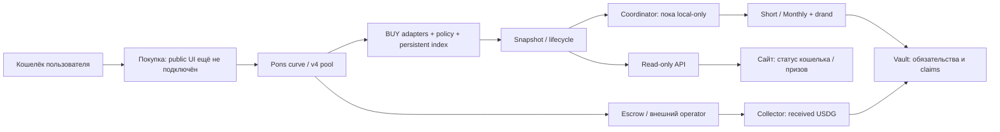

> Исторический снимок до уборки 02.10.2026. Не текущий план. [Актуальный контекст](../../../CURRENT_CONTEXT.md).

# R0: состав релиза и недостающие связи

02.10: [G10 — охват торговых маршрутов Pons](../../../PONS_CHANNEL_COVERAGE.md) обязателен перед окончательным G04: terminal payload/receipt, адаптеры, неизвестные маршруты и сквозной учёт. Статическая инвентаризация готова; live/UI admission ещё не закрыт.

01.10, обновление G02: [связка реализована и проверена локально](../../../SHARED_INDEX_CONFIG.md). Ниже сохранено исходное описание gap; live cutover и публичная активация отдельно.

Обновление после R0: [активный Pons-путь отделён от PAIR](../../../ACTIVE_RELEASE_PATH.md). Смешение plan/route из G04 и PAIR-тексты обеих тем из G09 устранены; G04 deployment/custody/параметры ещё не закрыт. Нижняя карта сохраняет исходный снимок R0.

01.10.2026. Статическая инвентаризация HEAD3b36e0a (runtime пакета12e64bb),
с незакоммиченными документами плана. Код, конфиги исполнения и правила не менялись.
Сервер/сеть не опрашивались; deployment status ниже — по репозиторию, не live audit.
Исторические PASS прочитаны как evidence, тесты в этом шаге не запускались.
R0 завершён как карта, не как сертификат полноты/security review.

## Итог

Локальное сквозное ядро реализовано. Публичный релиз пока требует реализации
entrypoints/config связей, затем квалификации: это не только прогон тестов.
Подтверждённая локальная цепочка: Pons BUY → admission/index → attempts →
Short/Monthly → drand → settlement/claims. Отдельный денежный поток:
доступный Pons USDG → collector credits90/5/5 → prize vault.
Необработанные TOKEN не призовой бюджет, недоступный operator не подменяется.

## Карта исполнения

Стрелки показывают назначение, не доказательство готовности всех публичных соединений.
В частности, общий snapshot для coordinator и overview API сейчас требует согласования.

| Узел / файлы | Классификация и текущее доказательство | Что осталось |
|---|---|---|
| `contracts/LocalPonsCollector.sol`, `scripts/pons-collector-manual.cjs` | Pons local candidate; received credits, historical recipients, sweep/pull/pay проверены локально | Production source admission/roles/deploy; manual runner также local-only |
| `contracts/DualControllerPromoVault.sol`, `RobinhoodShortController.sol`, `RobinhoodMonthlyController.sol` и их bases | Active candidate; локальные draws/claims | Проверка production constructor/immutable settings, общий code/security review, не считать слово Robinhood доказательством deployment |
| `contracts/DrandRandomAdapter.sol`, `scripts/drand-delivery-worker.cjs` | Active candidate; live BLS proof на fork, один round/context | Реальные timing/RPC, gas и публичный runner |
| `scripts/pons-curve-buy.cjs`, `pons-v4-buy.cjs`, `direct-buy.cjs`, `attempt-lifecycle.cjs` | Active adapters, узкий direct route; BUY/refund/net/carry/replay evidence | Перечень публично поддержанных маршрутов, live qualification, arbitrary aggregates не поддержаны автоматически |
| `contracts/BuyPolicySource.sol`, `scripts/buy-policy-*.cjs` | Genesis admission Pons реализован; unsupported extensions fail closed | Public deployment/genesis/publisher/notice manifest; расширения Pons не реализованы и не требуются для фиксированного initial route |
| `scripts/persistent-buy-indexer.cjs`, `local-scheduler-state.cjs` | Active read-side candidate; checksum/identity/cache/reorg, fork restart | Soak/scale/power-loss; state identity с API/coordinator, политика backup recovery |
| `scripts/pons-automation.cjs`, `run-pons-automation.cjs`, `local-promo-scheduler.cjs` | Research executable;13 проходов/22tx/107.337115USDG на fork77469814 | Публичный admitted entrypoint и signer, не удаление Hardhat guard |
| `scripts/pons-transaction-journal.cjs` и child RNG journal | Active primitive; process-kill окна и known/unknown hash | Полный Pons CLI crash/nonce/recovery, filesystem durability |
| `scripts/run-indexer-service.cjs`, `indexer-service-child.cjs`, `user-status-api.cjs`, `public-observation.cjs`, `public-status.cjs` | Read-only service реализован, worker/health/API primitives | Pons integrated publicStatus+shared snapshot проверка, API vs coordinator config identity |
| `scripts/start-public-service.cjs`, `deploy/public-api/qianqi-api.service`, `ops/rh-promo-indexer.service` | Read-only/standby entrypoint и Linux templates существуют | Выбрать один active deployment layout, проверить реальную установку/restore/monitoring; signer service здесь нет |
| `web/app.js`, `overview.js`, `concepts/hk/` | Wallet discovery/account handling, read-only статусы | Buy handler заглушка; нет пользовательского Claim действия; часть текстов PAIR |
| `scripts/pons-direct-purchase.cjs`, `pons-browser-bridge.cjs`, `web/purchase-demo/` | Research route planner + Playwright bridge, не public wallet adapter | Public-safe admission/quote/send/receipt flow с реальными providers |
| `scripts/pons-*-rehearsal.cjs`, `pons-collector-fork.cjs`, `test/fixtures/` | Только research/test, не production build | Не переносить impersonation, clock overrides, finalized=latest, synthetic balances в выпуск |
| `scripts/prepare-pair-launch.cjs`, `pair-launch-preview.cjs`, Infinity/PAIR adapters и fee-router workers | Сохранённый резерв/история | Не выбирать их по умолчанию в Pons release; не удалять |

## Подтверждённые разрывы и очередь закрытия

| ID | Тип / приоритет | Основание | Результат закрытия |
|---|---|---|---|
| G01 | Код, blocker | `run-pons-automation.cjs` требует loopback; `runtime-network.cjs:beforeSend` допускает только rehearsal+Hardhat instance; `pons-automation.cjs` использует этот режим | Отдельный public execution path, custody/nonce/budget/immutable admission, негативные tests; старые guards сохранены |
| G02 | Код связи, blocker общего API | `start-public-service.cjs` требует publicStatus=true; `schedulerConfigFor` его не передаёт; `readSnapshot` и API сверяют hash всего config | Канонический shared config либо явно раздельные snapshots; consumer identity и publicObservation tests, без ослабления checksum |
| G03 | Код/UX, blocker обещанного пути | `web/app.js` Buy → coming soon; rewards показывают assignment/payment links, не Claim; planner требует hardhat_metadata, bridge Playwright-only | Выбранный поддержанный BUY route и доступный проверяемый self-claim путь; public wallet review/receipt; неподдержанные кошельки/маршруты явно отмечены |
| G04 | Конфиг и deploy, blocker | `robinhood-launch-plan.json`: incomplete, null roles/custody/gas/notice/contracts; initialPurchase.routeVersion=Infinity; Pons draft local-only | Один исполнимый Pons manifest: deployments/address prediction, roles, fees, metadata, route, limits и read-only preflight; null не заменять fixtures |
| G05 | Проверка/решение, blocker timing | Candidate1800/1200, approval=null; локальный finalized shim | Замеры R3 + лаг/outage rehearsal, конкретные обоснованные настройки |
| G06 | Внешнее доверие / доступность | Source equivalence factory/escrow/operator неполная; local impersonation не доказывает наш доступ | Fresh pins/permissions/реально доступный manual funding; перечень принятых зависимостей и поведения при отказе. Независимый TOKEN conversion не обязательное новое требование |
| G07 | Эксплуатация, blocker | Templates read-only; Pons coordinator gas checks есть, подключения автоматического native refill в нём нет | Durable signer service/запуск/alerts/backup; funded native runway и проверенный способ пополнения. Авто-refill не объявлять готовым; scoped manual provisioning отдельно описать |
| G08 | Проверки, blocker RC | Существуют адресные результаты, не полный baseline release candidate | R1–R8: review/инварианты/full/browser/faults/soak; findings закрыты на точном RC |
| G09 | Тексты/документы, до публичного UI | HK и исходная тема называют PAIR Infinity; migration draft pending ещё перечисляет уже написанные BUY decoders | Согласовать актуальную карту/тексты с Pons без изменения100USDG/90-5-5 и сохранением PAIR reserve |

G02 подтверждён статическим сопоставлением функций, не тестом сервиса: один snapshot,
созданный с publicStatus=true, не совпадёт с identity конфига schedulerConfigFor.
С двумя разными файлами identity конфликт устраним, но это отдельная архитектура,
её цена и согласованность пока не проверены. Не объявляем весь read-only API сломанным.

G04 не означает, что нужно иметь будущие deployed addresses до локального аудита:
сначала детерминированный deployment plan и dry run, потом post-deploy проверка.
Public token launch через UI Pons сам по себе не разворачивает нашу призовую систему.

## Роли и остаточное доверие

| Роль / актив | Реальная возможность по коду | Потеря/компрометация и проверка |
|---|---|---|
| Governor/owner Short/Monthly | Объявляет будущие rules с notice; proposePublisher/acceptPublisher; inherited ownership | Риск будущих условий/доступности; проверить все owner paths R1. Immutable vault/controllers не становятся заменяемыми |
| Dataset publisher | begin/publish/supersede до freeze, closeEmpty | Доверие полноте BUY dataset и operational finality. On-chain shape/hash/BLS не доказывают, что publisher включил все честные покупки; нужен независимый replay/публикация артефактов |
| BuyPolicySource publisher | Immutable publisher, append-only announcements | Потеря ключа мешает развитию policy; неподдержанная activation блокирует новые cutoffs. Не приписывать ему возможность переписать старый hash |
| Collector owner | Одноразовые bindVenue/bindPromo; rollCampaign после срока | Проверить policy и преемственность credits; coordinator сейчас требует campaign1, rollover не автоматически поддержан |
| Executor | Оплачивает и запускает допустимые contract calls; в fork совмещён с publisher | Нужны отдельный ключ, custody и лимиты; не считать все полномочия permissionless executor равными publisher. Permissionless вызов не выполняет себя |
| Ops/project recipients | Получают свои уже начисленные credits | Это не право тратить frozen/claimable; потеря адреса может запереть соответствующие credits |
| Winner / любой caller claim | `PromoVault.claim(drawId,winner)` направляет сумму указанному победителю, не caller | Независимый self-claim маршрут нужен при недоступном исполнителе; transfer failure/blacklist предмет проверки |
| Drand сеть и adapter | Только заданные consumers создают request; prove/deliver публичны, round/seed фиксированы | Нет admin reroll/cancel; outage задерживает исполнение, не даёт выбирать новый random |
| RPC/indexer/publisher host | Доставляют branch/finality/history и dataset | Pins/checksums не доказывают честность RPC или полноту данных. Нужны R3 и независимая сверка |
| Pons admin/operator и USDG admin | Внешние контракты, права требуют live проверки | Возможные drift/funding/transfer ограничения; не утверждаем наличие конкретных полномочий без проверки |
| Web/DNS/operator сервера | Контролирует UI, API и links, не призовой контракт | Подмена адресов/calldata/статусов, утечка signer; CSP/access/deploy hashes/monitoring в R6/R7 |

Подтверждённый пользовательский owner/project:0x098afA6731239a00CE0aff669aaefD16b7C72114.
Отдельный automation wallet выбран концептуально, адрес/custody в плане не заполнены.
Ни один ключ не запрашивался и не создавался в R0.

## Краткая карта угроз и покрытия

| Сценарий | Уже имеющаяся защита/evidence | Остаток / пакет |
|---|---|---|
| Трейдер повторяет receipt, дробит BUY, refund или меняет recipient | Adapters/replay/net debit/carry tests | Multi-wallet экономические эффекты не обещать устранёнными; R2 |
| Оператор запускает две отправки или теряет ответ | Main/RNG journals, known/unknown hash, process-kill tests | Полный CLI, nonce replacement, потеря сохранённого intent; R5 |
| RPC отстал/подменил ветку | Admission pins, indexer branch/identity/freshness, cutoff history | Real finality/retention, dishonest RPC и concurrent watch; R3/R5/R6 |
| Publisher ошибся/злонамерен | Off-chain prebegin replay, immutable artifact, notices | On-chain не проверяет полноту всей торговой истории; аудит доверия и независимая проверяемость, R1/R2/R7 |
| Не работает Pons conversion | Pending не бюджет; independent escrow claim/pay | Наша реальная доступность manual calls и alert, R3/R6 |
| Получатель/токен не принимает перевод | Claim долг не должен исчезать при revert | Негативный recipient/ERC20 tests и доступный self-claim UX, R2/R5/R7 |
| Потерян диск/старый backup | Checksum+fsync file+rename | Каталог не fsync; старый валидный журнал может потерять intent/hash; R5/R6 |
| Скомпрометирован сайт/ключ | Локальный запрет public sends сейчас, pinned candidate contracts | Production permissions/custody, frontend supply chain, R1/R6/R7 |

## Следующий ограниченный шаг

R1: ручное review границ денег/полномочий и конфигурации + реестр code findings.
В первую очередь collector/vault/controller publisher trust, journals/send admission,
G02 identity и G04 смешение Pons/PAIR. Не начинать массовый refactor.
После review закрывать G02, G04, G01, G03 отдельными пакетами с адресными проверками;
timing R3 до выбора immutable deployment параметров. Любая новая реализация проходит
те же R1/R2 проверки; текущий R0 не закрывает недоделки автоматически.

Опорные evidence: [indexed cycle](../../../PONS_INDEXED_CYCLE.md),
[snapshot admission](../../../PONS_INDEXED_COORDINATOR.md), [indexer](../../../PONS_PERSISTENT_INDEXER.md),
[browser bridge](../../../PONS_BROWSER_BRIDGE.md), [review](../../../PONS_INDEXED_REVIEW_TRIAGE.md).
